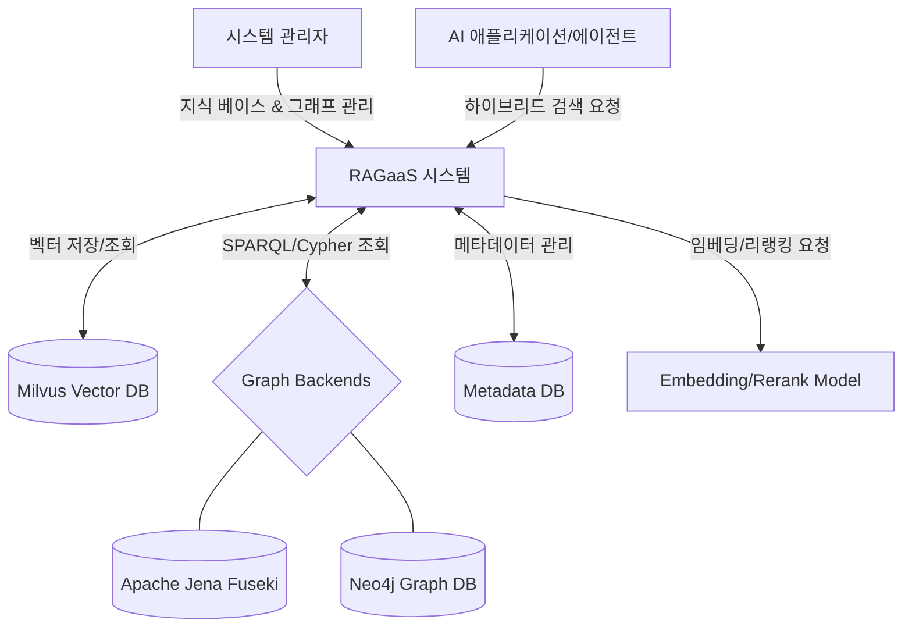

# 시스템 정의

## 시스템 개요

### 시스템 이름
RAGaaS (RAG as a Service) 통합 관리 시스템

### 시스템 목적
사용자가 다수의 지식 베이스(Knowledge Base)를 중앙에서 생성 및 관리하고, 비정형 문서에서 지식 그래프(Knowledge Graph) 및 온톨로지(Ontology)를 구축하며, 벡터 검색과 그래프 검색을 결합한 하이브리드 검색 파이프라인 및 실험 환경(Playground)을 제공하는 LLM 특화 지식 관리 플랫폼입니다.

### 시스템이 해결하려는 문제
- **복잡한 인프라 관리**: Milvus와 같은 벡터 데이터베이스와 임베딩 파이프라인을 직접 구축하고 운영하는 부담 해결
- **변동성 있는 검색 품질**: 단순 벡터 검색의 한계를 극복하기 위한 하이브리드 검색, 리랭킹, NER 필터링 등의 고급 기능 통합 제공
- **파편화된 지식 관리**: 여러 서비스에서 사용되는 지식 데이터를 지식 베이스 단위로 체계화하여 관리
- **테스트 및 검증의 어려움**: 검색 파라미터를 실시간으로 조정하며 결과를 즉시 확인할 수 있는 플레이그라운드 부재 해결

## 시스템 범위

### 포함 기능
- **지식 베이스 관리**: 네임스페이스 기반의 지식 베이스 및 지식 그래프 저장소 관리
- **지식 그래프 및 온톨로지 구축**: 문서 기반 엔티티-관계 추출(Triple Extraction) 및 온톨로지 자동 생성(Promotion)
- **문서 수집 및 처리**: PDF, TXT, Markdown 파일 업로드 및 하이브리드 처리(청킹 + 트리플 추출)
- **다차원 검색 전략**: 벡터 검색(Milvus), SPARQL(Fuseki)/Cypher(Neo4j) 그래프 검색, 하이브리드 파이프라인
- **파이프라인 실험 환경(Playground)**: 다양한 검색 전략 및 후처리 파라미터를 실시간으로 조합하고 실험할 수 있는 환경 제공
- **검색 후처리**: Cross-Encoder 리랭커, 패턴 기반 NER 필터 적용
- **관리자 UI**: 지식 베이스 현황 대시보드 및 실시간 검색 테스트 플레이그라운드

### 제외 기능
- **LLM 답변 생성 (Generation)**: 본 시스템은 검색(Retrieval) 결과 제공에 집중하며, 최종 답변 생성 로직은 외부 LLM 서비스의 책임임
- **사용자 인증 및 권한 관리**: 엔터프라이즈급 인증 서비스는 별도 시스템 또는 인프라 레이어에서 담당
- **임베딩 모델 학습**: 사전 학습된(Pre-trained) 모델을 사용하며, 모델 자체의 파인튜닝은 범위에서 제외

### 범위 설정 근거
- RAG의 핵심인 '데이터 관리'와 '정밀 검색'에 집중하여 가벼우면서도 강력한 Retrieval 엔진 구축
- 답변 생성부는 사용자의 LLM 선택(OpenAI, Claude, Local LLM 등)에 따라 유연하게 대응할 수 있도록 인터페이스만 제공
- Dify와 같은 전문 RAG 솔루션의 핵심 기능을 벤치마킹하여 실용적인 관리 도구 지향

## 시스템 경계

### 사용자 유형
- **시스템 관리자**: 지식 베이스를 구축하고 문서를 관리하며, 검색 성능을 튜닝하는 운영자
- **AI 애플리케이션 (Client)**: REST API를 통해 검색 결과를 받아 LLM 답변 생성에 활용하는 서비스

### 외부 환경
- **Milvus**: 대규모 밀집 벡터 데이터를 저장하고 고속 ANN 검색을 수행하는 엔진
- **Apache Jena Fuseki**: SPARQL 기반의 RDF 데이터 저장 및 온톨로지 추론 엔진
- **Neo4j**: Cypher 쿼리를 지원하는 고성능 그래프 데이터베이스
- **임베딩/리랭킹 모델**: HuggingFace 또는 OpenAI 기반의 텍스트 분석 및 재정렬 모델

### 인터페이스 (고수준)
- **REST API**: 외부 앱 연동 인터페이스
  - Knowledge Base & Graph CRUD API
  - Triple Extraction & Ontology Promotion API
  - Composite Retrieval API (Vector + Graph)
- **관리자 웹 UI (React)**:
  - 지식 베이스 및 그래프 스키마(Ontology) 시각화 화면
  - 검색 파이프라인 실험 전용 플레이그라운드 (다양한 검색 전략 조합 실험 가능)
  - 문서 업로드 및 처리 상태 모니터링

## 제약사항

### 기술적 제약사항
- **데이터베이스**: Milvus(Vector) 및 Graph Engine(Fuseki 또는 Neo4j) 동시 운영 필요
- **프레임워크**: FastAPI(Backend) 및 React/Vite(Frontend) 기반
- **일관성**: 비정형 문서에서 추출된 청크와 그래프 데이터(Triple/Node-Edge) 간의 정합성 유지 필요
