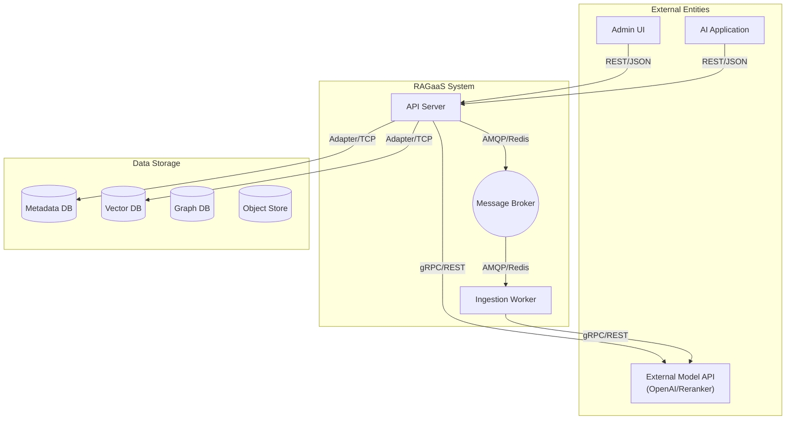
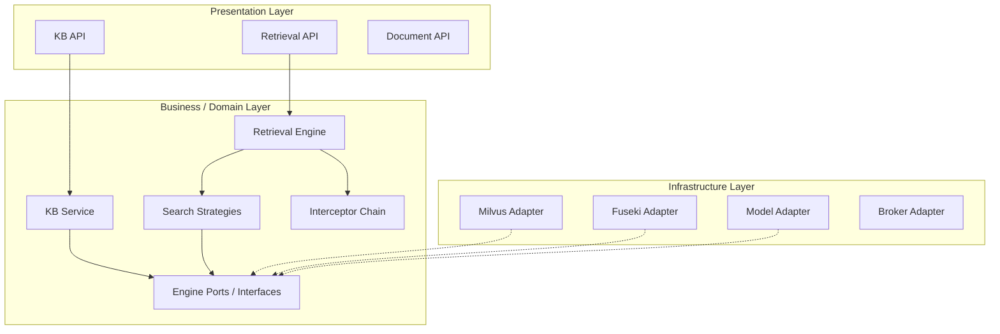

# 소프트웨어 아키텍처 명세서 (Architecture Specification)

본 문서는 RAGaaS 통합 관리 시스템의 전체적인 구조와 설계 결정을 상세히 기술합니다. 사용자가 다수의 지식 베이스를 중앙에서 관리하고, 비정형 문서로부터 지식 그래프를 구축하며, 최적의 검색 파이프라인을 실험할 수 있는 신뢰성 있고 확장 가능한 플랫폼을 구축하는 것을 목표로 합니다.

## 1. 개요

### 1.1 시스템 정의
RAGaaS(RAG as a Service) 통합 관리 시스템은 벡터 검색과 지식 그래프 검색을 결합하고, 런타임에 검색 전략을 동적으로 최적화할 수 있는 LLM 특화 지식 관리 플랫폼입니다.

#### 시스템 경계 및 컨텍스트

```mermaid
graph TD
    User[시스템 관리자]
    App[AI 애플리케이션/에이전트]
    RMS[RAGaaS 시스템]
    Milvus[(Milvus Vector DB)]
    GraphBackends{Graph Backends}
    Fuseki[(Apache Jena Fuseki)]
    Neo4j[(Neo4j Graph DB)]
    SQLite[(Metadata DB)]
    Embedding[Embedding/Rerank Model]

    User -->|지식 베이스 & 그래프 관리| RMS
    App -->|하이브리드 검색 요청| RMS
    RMS <-->|벡터 저장/조회| Milvus
    RMS <-->|SPARQL/Cypher 조회| GraphBackends
    GraphBackends --- Fuseki
    GraphBackends --- Neo4j
    RMS <-->|메타데이터 관리| SQLite
    RMS -->|임베딩/리랭킹 요청| Embedding
```


#### 주요 Actor
- **시스템 관리자**: 지식 베이스 구축, 문서 관리, 검색 파이프라인 튜닝 및 운영.
- **AI 애플리케이션**: REST API를 통해 최적화된 컨텍스트 조각을 획득하는 인터페이스 클라이언트.

### 1.2 비즈니스 컨텍스트
- **비즈니스 목표**: 기업 내부 데이터를 활용한 RAG 시스템 구축 비용 절감 및 검색 정밀도(Precision/Recall) 극대화.
- **비즈니스 가치**: 지식 베이스 관리 자동화, 하이브리드 검색 기반의 추론 능력 강화, 플레이그라운드를 통한 실시간 성능 최적화.

### 1.3 제약 사항
- **기술적 제약**: Milvus(Vector) 및 Graph 엔진(Fuseki/Neo4j) 동시 운영 필수, FastAPI(Backend) 및 React(Frontend) 기반.
- **일관성 제약**: 비정형 텍스트 청크와 추출된 지식 그래프 데이터 간의 정합성 유지 필요.

## 2. 요구사항

### 2.1 기능 요구사항 (ASR)
시스템 구조에 결정적인 영향을 미치는 핵심 기능 요구사항(Architecturally Significant Requirements)은 다음과 같습니다.

- **ASR-101: 하이브리드 검색 수행**: 벡터(ANN)와 키워드(BM25) 검색 결과를 결합(RRF)하고 리랭킹하는 기능.
- **ASR-103: 저장소 오케스트레이션**: 이종 DB(Vector, Graph, Meta) 자원을 일관성 있게 할당하고 관리.
- **ASR-203: 대용량 데이터 확장성**: 백만 건 이상의 청크 규모에서도 성능 저하 없이 인덱싱 및 검색 수행.
- **ASR-204: 검색 파이프라인 실험**: 서버 재시작 없이 검색 전략 및 파라미터를 런타임에 동적으로 변경.

### 2.2 품질 요구사항 (QA)
| ID | 품질 속성 | 설명 | 우선순위 |
| :--- | :--- | :--- | :---: |
| **QA-001** | 성능 | 하이브리드 검색 응답 시간 최소화 (지연 시간 억제) | 1 |
| **QA-002** | 변경 용이성 | AI 모델 및 엔진 교체 시 핵심 로직 수정 최소화 (유연성) | 2 |
| **QA-003** | 확장성 | 대규모 데이터 및 요청 부하에 대한 수평적 확장 가능성 | 3 |
| **QA-004** | 사용성 | 플레이그라운드 설정 변경의 즉각적인 반영 | 4 |

---

## 3. 시스템 구조 (Deployment Architecture)

시스템은 가용성과 확장성을 보장하기 위해 서비스와 작업 단위를 물리적으로 분리한 배치 구조를 취합니다.

### 3.1 전체 배치 다이어그램


### 3.2 컴포넌트 명세
- **API Server**: 실시간 관리 요청 및 검색 질의를 처리하는 핵심 엔진. 전략 기반 검색 엔진(CA-101)을 내장하여 동적 파레미터(CA-204)를 수용합니다.
- **Ingestion Worker**: 문서 파싱, 임베딩, 트리풀 추출 등 무거운 작업을 비동기로 처리하여 API 서버의 응답성을 보장(CA-203)합니다.
- **Storage Tier**: 헥사고날 어댑터(CA-202)를 통해 결합도를 낮추고, 네임스페이스 기반 인덱스 분할(CA-106)로 성능을 최적화합니다.

### 3.3 주요 동작 및 품질 설계
- **검색 성능 극대화**: 비동기 병렬 검색 흐름(CA-201)을 적용하여 임베딩과 키워드 검색을 동시 수행함과 동시에, 세마포어(CA-201A)를 통해 시스템 과부하를 방지합니다.
- **부하 평준화**: 메시지 큐를 통한 비동기 인스트럭션 구조(CA-203)를 채택하여 대량의 문서 유입 시에도 API 서버가 중단되지 않습니다.

---

## 4. 모듈 구조 (Module Architecture)

### 4.1 전체 모듈 다이어그램


### 4.2 품질 설계 및 유연성
- **Port & Adapter (Hexagonal)**: `domain/ports` 레이어에 추상 인터페이스를 정의하고 `infrastructure/persistence`에서 구체 구현을 담당하게 하여, 엔진 교체 시 도메인 로직을 보호합니다.
- **동적 필터 체인**: 후처리 인터셉터 체인(CA-104)을 통해 리랭킹, NER 필터 등을 런타임에 자유롭게 On/Off 하거나 순서를 변경할 수 있습니다.

### 4.3 폴더 구조 매핑
```
RAGaaS/
├── app/
│   ├── api/                   # Presentation: 라우터 및 인터페이스
│   ├── domain/                # Business: 핵심 로직, 전략, 인터셉터, 포트
│   │   ├── ports/             # 엔진 추상 인터페이스
│   │   ├── strategies/        # 검색 전략 구현체
│   │   └── interceptors/      # 후처리 필터 체인
│   ├── infrastructure/        # Infrastructure: DB 어댑터 및 외부 API 클라이언트
│   └── worker/                # 비동기 인스트럭션 워커 진입점
```

---

## 부록 (Appendix)

### 부록 A. 품질 시나리오 평가 및 선정 결과
| 시나리오 ID | 품질 속성 | 중요도 | 난이도 | 비즈니스 영향도 | 채택 QA |
| :--- | :--- | :---: | :---: | :---: | :--- |
| **QS-001** | 성능 | 매우 높음 | 높음 | 매우 높음 | QA-001 |
| **QS-003** | 변경 용이성 | 중간 | 높음 | 높음 | QA-002 |
| **QS-005** | 확장성 | 높음 | 매우 높음 | 높음 | QA-003 |
| **QS-007** | 사용성 | 높음 | 중간 | 높음 | QA-004 |

### 부록 B. 후보 구조 결정 내역
| ID | 후보 구조 제목 | 채택 여부 | 결정 근거 |
| :--- | :--- | :---: | :--- |
| **CA-101** | 전략 기반 검색 엔진 | **채택** | 동적 검색 실험을 위한 핵심 구조 |
| **CA-102** | 파이프라인 기반 흐름 제어 | **기각** | 동적 분기 처리 및 성능 오버헤드 면에서 불리함 |
| **CA-201** | 비동기 병렬 검색 흐름 | **채택** | 검색 응답 시간 단축을 위한 필수 성능 전술 |
| **CA-202** | 플러그형 엔진 어댑터 | **채택** | 엔진 교체 유연성(Hexagonal) 확보 |
| **CA-203** | 메시지 큐 기반 워커 분산 | **채택** | 대량 데이터 유입 시 안정성 보장 |

---
*본 문서는 설계 과정의 모든 산출물을 통합한 최종 아키텍처 명세서입니다.*
