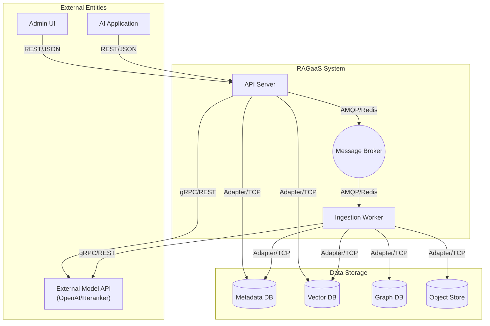
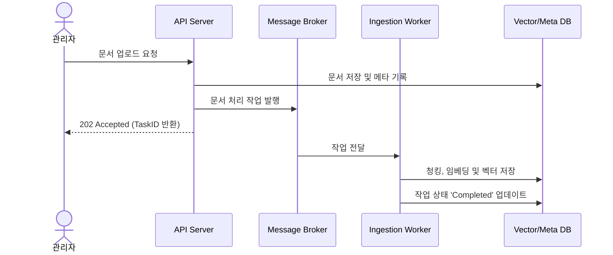

# 배치 구조 (Deployment Architecture)

## 개요

### 목적
RAGaaS 통합 관리 시스템의 가용성, 확장성 및 성능 요구사항을 충족하기 위한 물리적/논논리적 배치 단위와 이들 간의 상호작용 구조를 정의합니다.

### 설계 근거
- **채택된 후보 구조**: CA-101, CA-103, CA-104, CA-201, CA-201A, CA-202, CA-203, CA-204, CA-106
- **주요 설계 결정**: 
    - **비동기 부하 평준화**: 대량 문서 처리의 병목을 방지하기 위해 검색 API와 인제스션 워커를 분리합니다.
    - **전략적 유연성**: 런타임에 검색 엔진 전략을 교체하고 파라미터를 전파할 수 있는 컨텍스트 기반 구조를 채택합니다.
    - **데이터 격리**: 멀티테넌시 및 성능을 위해 지식 베이스(KB) 단위로 물리적 인덱스를 분리합니다.

## 배치 단위 목록

### 1. API Server (RAGaaS Core)
- **유형**: 마이크로서비스 (FastAPI/Python)
- **책임**: 지식 베이스 관리(CRUD), 하이브리드 검색 요청 처리, 실험 파라미터 컨텍스트 관리.
- **포함 컴포넌트**: AppAPI (B), KBManager (C), RetrievalEngine (C).
- **채택된 후보 구조**: CA-101 (Strategy), CA-103 (Provisioner), CA-104 (Interceptor), CA-201/201A (Parallel/Throttling), CA-204 (Context).

### 2. Ingestion Worker Cluster
- **유형**: 비동기 프로세스 워커
- **책임**: 대량 문서 파싱, 청킹, 임베딩 생성 및 지식 트리플 추출.
- **포함 컴포넌트**: IngestionEngine (C), OntologyEngine (C).
- **채택된 후보 구조**: CA-203 (Queue-based Load Leveling).

### 3. Message Broker
- **유형**: 메시징 미들웨어 (Redis 또는 RabbitMQ)
- **책임**: API 서버로부터 수신된 문서 처리 요청을 큐잉하고 워커로 분산.
- **채택된 후보 구조**: CA-203.

### 4. Storage Tier
- **유형**: 이종 데이터베이스 클러스터
- **책임**: 메타데이터, 벡터 인덱스, 지식 그래프 데이터 영속화.
- **포함 컴포넌트**: MetaDB (E), VectorDB (E), GraphDB (E), FileStore (E).
- **채택된 후보 구조**: CA-106 (Namespace Partitioning), CA-202 (Plugin Adapters).

## 배치 구조 다이어그램

## 컴포넌트 구성

### API Server

| 컴포넌트 | 유형 | 역할 | 인터페이스 |
| :--- | :--- | :--- | :--- |
| **AppAPI** | Boundary | RESTful API 엔드포인트 제공 및 요청 검증 | OpenAPI v3 |
| **KBManager** | Control | KB 생명주기 관리 및 자원 프로비저닝 트리거 | Internal Call |
| **RetrievalEngine** | Control | 하이브리드 검색 전략 실행 및 결과 리랭킹 | Strategy Interface |

### Ingestion Worker

| 컴포넌트 | 유형 | 역할 | 인터페이스 |
| :--- | :--- | :--- | :--- |
| **IngestionEngine** | Control | 문서 처리 파이프라인(청킹/임베딩) 실행 | Queue Consumer |
| **OntologyEngine** | Control | 구조화된 지식(트리플) 추출 및 스키마 업데이트 | Internal Call |

## 커넥터 정의

### 배치 단위 간 커넥터

| 출발지 | 목적지 | 통신 방식 | 프로토콜 | 데이터 형식 | 목적 |
| :--- | :--- | :--- | :--- | :--- | :--- |
| Admin/AIApp | API Server | 동기 | HTTP/S | JSON | 관리 및 검색 요청 |
| API Server | Message Broker | 비동기 | AMQP/Redis | JSON | 문서 처리 작업 의뢰 |
| Ingestion Worker | API Server | 비동기 | AMQP/Events | JSON | 작업 완료 통지 (UI 업데이트용) |
| System | Storage Tier | 동기 | TCP (Native) | Protocol Buffer / SQL | 데이터 영속성 관리성 |

## 주요 Use Case 동작

### UC-101: 지식 베이스 생성 및 문서 업로드

#### 동작 흐름
1. 관리자가 Admin UI에서 문서를 업로드한다.
2. **API Server**가 문서를 저장소에 적재하고 메타데이터를 MetaDB에 저장한다.
3. API Server가 **Message Broker**로 인제스션 작업을 발행한다.
4. **Ingestion Worker**가 큐에서 작업을 가져와 비동기로 청킹/임베딩을 수행한다.
5. 워커가 완료 후 **VectorDB**에 저장하고 상태를 'Completed'로 변경한다.

### UC-201: 하이브리드 검색 수행

#### 동작 흐름
1. AI App이 검색 쿼리를 전송한다.
2. **RetrievalEngine**이 CA-201에 따라 임베딩 요청과 키워드 검색을 병렬로 트리거한다.
3. CA-201A(Semaphore)를 통해 최대 동시 검색 세션을 제어한다.
4. 수집된 결과를 CA-104(Interceptor) 체인을 통해 리랭킹하고 최종 반환한다.

## 품질 요구사항 확인

### 성능 (QA-001)
- **병렬 처리 (CA-201)**: 임베딩과 키워드 검색을 동시 수행하여 하이브리드 검색 레이턴시를 Critical Path 수준으로 단축함.
- **Throttling (CA-201A)**: 동시 요청 폭주 시에도 세마포어를 통해 안정적인 응답 속도를 유지함.

### 확장성 (QA-003)
- **워커 클러스터 (CA-203)**: 대량의 문서 파일 유입 시 워커 수(Replica)를 늘려 수평적 확장이 가능함.
- **인덱스 파티셔닝 (CA-106)**: KB 단위 컬렉션 분리를 통해 전체 데이터 규모와 무관하게 개별 검색 성능을 일정하게 유지함.

### 유연성 및 변경 용이성 (QA-002)
- **어댑터 구조 (CA-202)**: Storage Tier와의 통신이 어댑터로 캡슐화되어 있어, Fuseki를 Neo4j로 교체할 때 핵심 로직 수정 없이 배포 가능함.
- **동적 전략 (CA-101, 204)**: 플레이그라운드의 설정 변경이 서버 재시작 없이 즉시 검색 결과에 반영됨.

## 채택된 후보 구조 반영

| 후보 구조 | 배치 단위 | 반영 내용 |
| :--- | :--- | :--- |
| CA-101 | API Server | `RetrievalEngine` 내에 전략 패턴을 적용하여 동적 실행 경로 확보. |
| CA-203 | Ingestion Worker | 문서 수집 로직을 별도 워커로 분산하여 부하 평준화 구현. |
| CA-202 | Storage Tier | 모든 DB 엔진 인터페이스에 어댑터 레이어를 적용하여 기술 독립성 확보. |
| CA-106 | Vector DB | `KBManager`가 KB 생성 시 전용 컬렉션을 물리적으로 할당하도록 설계. |
