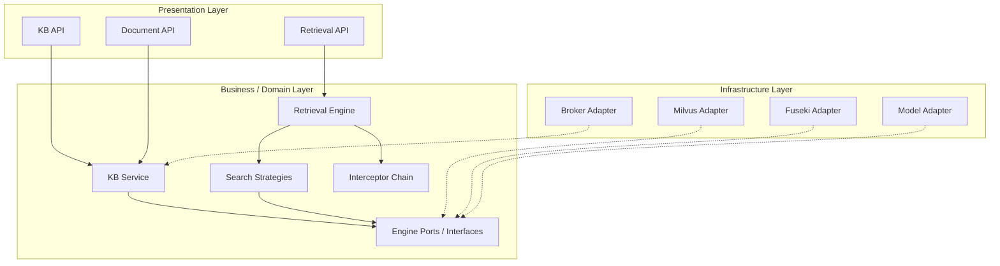

# 모듈 구조 (Module Architecture)

## 개요

### 목적
개발 생산성, 유지보수성 및 기술 교체 유연성을 확보하기 위해 시스템의 논리적 계층(Layer)과 모듈(Module) 간의 의존성 및 프로젝트 폴더 구조를 정의합니다.

### 설계 근거
- **채택된 후보 구조**: CA-101, CA-103, CA-104, CA-201, CA-202, CA-203, CA-204, CA-106
- **주요 설계 결정**:
    - **Hexagonal Architecture (Ports and Adapters)**: 엔진 및 데이터 저장소에 대한 구체적인 기술 종속성을 도메인 로직에서 분리합니다.
    - **Strategy & Interceptor Pattern**: 검색 및 후처리 로직을 동적으로 전환 가능하도록 캡슐화합니다.
    - **Dependency Inversion**: 고수준 정책(비즈니스 로직)이 저수준 디테일(인프라 구현)에 의존하지 않도록 인터페이스를 활용합니다.

## 레이어 구조

### 1. Presentation Layer (API)
- **책임**: 외부 요청(HTTP) 수신 및 검증, 응답 포맷팅, 비즈니스 레이어 호출.
- **포함 모듈**: `api.knowledge_base`, `api.retrieval`, `api.document`.
- **의존성**: Business Layer.

### 2. Business/Domain Layer (Logic)
- **책임**: 핵심 비즈니스 로직 처리, 검색 전략(Strategy) 엔진, 후처리 인터셉터 관리, 도메인 엔티티 정의.
- **포함 모듈**: `services.kb_manager`, `services.retrieval_engine`, `domain.strategy`, `domain.interceptor`, `domain.context`.
- **의존성**: Infrastructure Layer (인터페이스/Port를 통한 역전).

### 3. Infrastructure Layer (Adapters)
- **책임**: 데이터베이스(Vector/Graph/Meta) 연동 구현, 외부 API(OpenAI) 클라이언트, 메시지 큐 연동.
- **포함 모듈**: `infrastructure.vector_adapter`, `infrastructure.graph_adapter`, `infrastructure.model_adapter`, `infrastructure.message_broker`.
- **의존성**: 없음 (최하위 레이어).

## 모듈 구조 다이어그램



## 의존성 관계

### 레이어 간 의존성

| 레이어 A | 레이어 B | 의존성 방향 | 의존성 유형 |
| :--- | :--- | :--- | :--- |
| Presentation | Business | A -> B | 구체 구현체 호출 |
| Business | Infrastructure | A <- B | **의존성 역전 (Port 사용)** |

### 모듈 간 의존성

| 모듈 A | 모듈 B | 의존성 방향 | 의존성 유형 | 목적 |
| :--- | :--- | :--- | :--- | :--- |
| `RetrievalEngine` | `SearchStrategy` | A -> B | 인터페이스 호출 | 동적 검색 전략 실행 |
| `RetrievalEngine` | `PostInterceptor` | A -> B | 인터페이스 호출 | 결과 후처리(리랭킹 등) |
| `MilvusAdapter` | `VectorStorePort` | A -> B | 구현/상속 | 구체 엔진 로직 은폐 |

## 모듈 목록

### RetrievalEngine
- **유형**: Control
- **레이어**: Business
- **책임**: 검색 요청 수신 후 병렬(CA-201)로 복수의 전략을 실행하고 최종 결과를 필터링.
- **채택된 후보 구조**: CA-101, CA-201.

### KBProvisioner
- **유형**: Control
- **레이어**: Business
- **책임**: KB 생성 시 Milvus 컬렉션 할당(CA-106) 및 메타데이터 동기화(CA-103).
- **채택된 후보 구조**: CA-103, CA-106.

### ModelAdapter
- **유형**: Infrastructure (Boundary)
- **레이어**: Infrastructure
- **책임**: 외부 모델(Embedding, Reranker) API 호출 래핑.
- **채택된 후보 구조**: CA-202.

## 프로젝트 구조 (FastAPI/Python 추천 구조)

```
RAGaaS/
├── app/
│   ├── api/                   # Presentation Layer (Routes)
│   │   ├── v1/
│   │   │   ├── knowledge_base/
│   │   │   ├── document/
│   │   │   └── retrieval/
│   │   └── dependencies.py    # DI 컨테이너 역할
│   ├── core/                  # Global Configs & Constants
│   ├── domain/                # Business/Domain Layer (Logic)
│   │   ├── models/            # Domain Entities
│   │   ├── ports/             # Abstract Interfaces (Port)
│   │   ├── services/          # Pure Business Logic
│   │   ├── strategies/        # CA-101 Search Strategies
│   │   └── interceptors/      # CA-104 Filter Handlers
│   ├── infrastructure/        # Infrastructure Layer (Adapters)
│   │   ├── persistence/       # DB Clients (Milvus, SQL, Graph)
│   │   ├── model_clients/     # OpenAI, HF Adapter
│   │   └── message_queue/     # CA-203 Redis Broker
│   └── worker/                # Ingestion Worker Entrypoint
├── tests/                     # Unit & Integration Tests
└── main.py                    # App Entrypoint
```

## 품질 요구사항 확인

### 변경 용이성 (Modifiability)
- **엔진 독립성**: `domain/ports`를 통해 DB 엔진 교체 시 도메인 로직 수정 없이 `infrastructure/persistence` 내의 어댑터만 추가하여 대응 가능함 (CA-202 만족).
- **동적 확장**: 리랭킹이나 필터 기능 추가 시 `interceptors` 내에 새로운 클래스를 추가하고 체인에 등록하는 것만으로 기능 확장이 가능함 (CA-104 만족).

### 테스트 용이성 (Testability)
- **모킹 가능성**: 모든 외부 의존성이 인터페이스(Port)로 추상화되어 있어, 단위 테스트 시 실제 Milvus나 OpenAI 없이도 모의 객체(Mock)를 통한 비즈니스 로직 테스트가 용이함.

### 재사용성 (Reusability)
- **전략의 재사용**: 동일한 ANN 전략이나 BM25 전략을 서로 다른 KB 유형이나 파이프라인에서 공유하여 사용할 수 있음.
