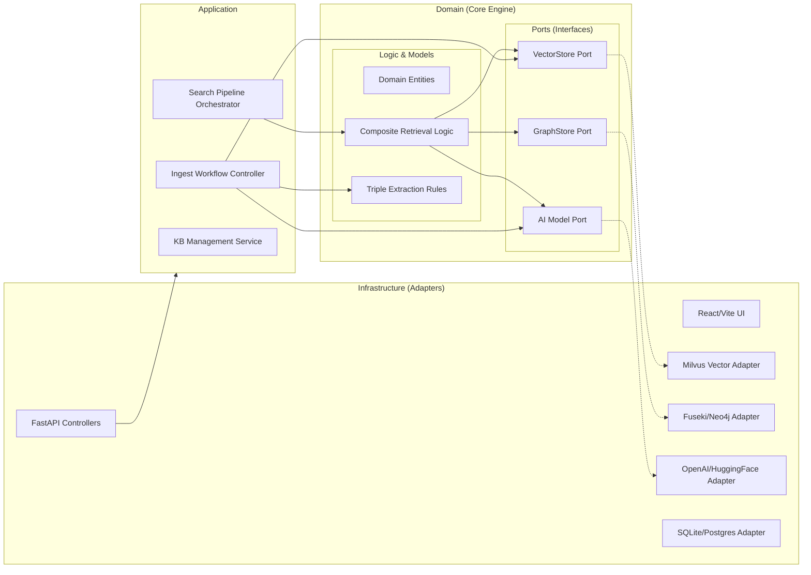

# 시스템 아키텍처 스타일 결정서

## 1. 아키텍처 스타일 후보

시스템의 비즈니스 가치와 ASR(아키텍처적 유의미한 요구사항)을 충족하기 위한 아키텍처 스타일 후보로 다음 두 가지를 선정하였습니다.

### 후보 1: Hexagonal Architecture (Ports & Adapters)
- **개요**: 비즈니스 로직(Core)을 외부 기술(Vector DB, Graph DB, AI 모델, UI)로부터 완전히 격리하고 인터페이스(Port)를 통해 소통하는 스타일입니다.
- **특징**: 기술 스택 교체가 잦은 AI 도메인에서 도메인 로직의 순수성을 유지하고 테스트 용이성을 극대화합니다.

### 후보 2: Layered Architecture (Multi-Tier)
- **개요**: 시스템을 Presentation, Application, Domain, Infrastructure 계층으로 수직 분리하는 전통적 스타일입니다.
- **특징**: 이해가 쉽고 초기 개발 속도가 빠르나, 하위 계층(DB 등)에 대한 코드 종속성이 발생하기 쉬워 유연성이 다소 떨어집니다.

## 2. 비교 평가

| 평가 기준 | 후보 1 (Hexagonal) | 후보 2 (Layered) | 관련 ASR |
| :--- | :--- | :--- | :--- |
| **품질 속성 만족도** | **최우수**. 엔진 교체 시 도메인 로직 수정이 불필요함. | **보통**. 엔진 교체 시 서비스 레이어의 수정 범위가 넓음. | ASR-202, ASR-301 |
| **실험성 및 확장성** | **최우수**. 전략 패턴(Strategy)을 도메인 레벨에서 구성하기 용이함. | **보통**. 다양한 검색 전략이 서비스 레이어에 비대하게 집중될 위험. | ASR-104, ASR-105 |
| **복잡성 및 구현 비용** | **높음**. 포트 정의 및 데이터 변환 매퍼(Mapper) 구현 비용 발생. | **낮음**. 직관적인 구조로 초기 학습 및 구현 비용이 적음. | - |
| **제약 사항 준수** | **우수**. 이종 DB(Milvus, Neo4j) 간의 독립적 어댑터 구성을 강제함. | **보통**. DB 액세스 로직이 섞여 정합성 제어가 복잡해질 수 있음. | ASR-301, ASR-303 |
| **종합 적합성** | **최적**. 장기적인 기술 유연성이 필수적인 RAGaaS에 적합. | **미흡**. 빈번한 기술 변화에 대응하기에는 유지보수 비용이 큼. | - |

## 3. 최종 결정

### 채택된 스타일: Hexagonal Architecture (Ports & Adapters)

### 결정 근거
- **기술 종속성 제거 (ASR-202, ASR-301)**: Milvus, Fuseki, Neo4j 등 다양한 검색 엔진과 외부 AI API(Embedding, Rerank)를 유연하게 교체하기 위해 추상화된 Port 인터페이스가 필수적입니다.
- **도메인 로직의 자산화 (ASR-101, ASR-102)**: 하이브리드 검색 결과 통합 및 점수 정규화 로직은 이 시스템의 핵심 자산입니다. 이를 인프라 기술로부터 분리하여 독립적으로 검증하고 보호해야 합니다.
- **동적 파이프라인 구성 (ASR-104, ASR-105, ASR-204)**: 플레이그라운드 환경에서 실시간으로 변하는 검색 전략을 도메인 엔진 내에서 동적으로 조립(Strategy Pattern)하기 위해 외부 세계와 격리된 아키텍처가 유리합니다.

## 4. 시스템 기본 구조 정의

선정된 헥사고날 스타일을 기반으로 시스템을 **Domain**, **Application**, **Infrastructure**의 세 구역으로 정의합니다.

### 구역별 책임 설명
- **Domain (Inner Circle)**:
  - **Models**: KnowledgeBase, Document, Chunk, Triple 등 순수 도메인 객체.
  - **Ports (Interfaces)**: VectorStorePort, GraphStorePort, EmbeddingPort 등 외부 통신 규약.
  - **Domain Services**: 하이브리드 검색 점수 통합(RRF), 온톨로지 추론 로직 (ASR-102 연관).
- **Application (Use Cases)**:
  - 사용자 요청(Use Case)의 흐름 제어 (예: "검색 실행", "문서 수집").
  - 도메인 모델을 조합하여 비즈니스 가치를 완성.
- **Infrastructure (Adapters)**:
  - **Inbound**: FastAPI Controller, UI API (ASR-302 연관).
  - **Outbound**: MilvusAdapter, GraphStoreAdapter, OpenAIAdapter, MetaDBAdapter.

### 구조 시각화

