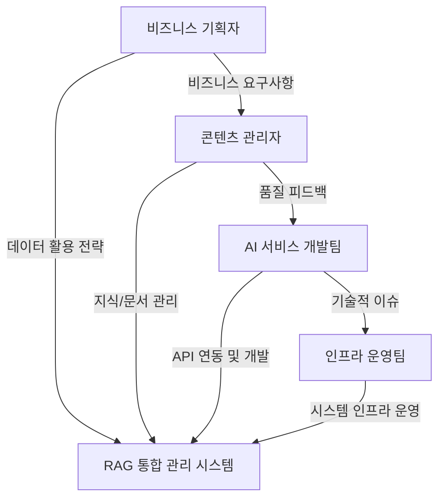

# 비즈니스 요구사항

## 비즈니스 개요

### 비즈니스 배경
LLM(Large Language Model) 기반 애플리케이션의 핵심인 RAG(Retrieval-Augmented Generation) 시스템은 지식 베이스 관리, 문서 전처리(청킹), 효율적인 검색 전략 등 복잡한 과정을 포함합니다. 단순 벡터 검색의 한계를 극복하기 위해 비정형 데이터(문서)에서 정형 정보(엔티티, 관계)를 추출하는 지식 그래프(Knowledge Graph)와 이를 체계화하는 온톨로지(Ontology) 구축에 대한 필요성이 대두되고 있습니다. 사용자들은 다양한 검색 파이프라인을 실험하고 최적의 지식 추출 방식을 선택할 수 있는 통합 환경을 요구하고 있습니다.

### 비즈니스 목적
RAGaaS(RAG as a Service) 통합 관리 시스템을 통해 다음과 같은 비즈니스 목적을 달성하고자 합니다:
- 다수의 지식 베이스를 중앙에서 효율적으로 생성 및 관리
- 사용자 친화적인 UI를 통한 문서 업로드, 청킹 및 인덱싱 자동화
- Jena/Fuseki 및 Neo4j를 활용한 멀티 백엔드 지식 그래프(Knowledge Graph) 구축 및 검색 제공
- 다양한 검색 전략 및 파이프라인(ANN, Keyword, Hybrid, Graph) 실험 환경(Playground) 제공
- 일관된 점수 체계(Score System)를 통한 검색 성능 분석 및 최적화 지원

### 비즈니스 가치 제안
- **개발 생산성 향상**: 복잡한 Milvus, Jena/Fuseki, Neo4j 엔진 조작 없이 API와 UI를 통해 신속한 RAG 및 KG 시스템 구축 가능
- **검색 품질 최적화**: 지식 그래프와 리랭커(Reranker) 등의 고도화된 기능을 통해 복잡한 추론 및 정밀 검색 성능 강화
- **운영 편의성**: 문서 처리 상태 모니터링 및 플레이그라운드를 통한 실시간 파이프라인 실험 환경 지원
- **데이터 기반 의사결정**: 정형(Graph)/비정형(Vector) 데이터 통합 검색을 통한 다각도 검색 인사이트 제공

## 비즈니스 목표

### 단기 목표 (1-3개월)
- 지식 베이스 및 문서 관리 핵심 기능(CRUD) 구현 완료
- Milvus 기반 벡터 검색 및 Jena/Fuseki, Neo4j 기반 지식 그래프 연동 안정화
- 웹 기반 관리자 UI 및 API 서버 아키텍처 구축
- 기본 검색 테스트 플레이그라운드 및 엔티티/관계 추출 기능 제공

### 중기 목표 (3-6개월)
- 고급 검색 전략(Hybrid Search, Graph Search) 및 리랭커 연동 고도화
- 지식 그래프로부터 온톨로지(Ontology) 자동 생성(Promotion) 및 추론 기능 강화
- 검색 파이프라인 실험 환경(Playground) 고도화 및 파라미터 최적화 도구 제공
- 메타데이터 데이터베이스의 PostgreSQL 확장 및 대용량 데이터 처리 최적화

### 장기 목표 (6개월 이상)
- 다양한 임베딩 모델 및 외부 LLM 제공업체(OpenAI, Anthropic 등) 연동 확대
- 자동화된 RAG 평가(RAGAS 등) 툴릿 통합 및 성능 리포트 자동 생성
- 엔터프라이즈급 권한 관리(RBAC) 및 보안 프레임워크 적용
- 지식 그래프(Knowledge Graph) 연동을 통한 하이브리드 지식 추출 확장 검토

### 목표 우선순위
1. **최우선**: 지식 베이스/문서 CRUD 및 Milvus 벡터 연동 (단기 목표)
2. **높음**: 관리자 UI 고도화 및 하이브리드 검색 구현 (단기/중기 목표)
3. **중간**: 리랭커, NER 필터 등 후처리 기능 안정화 (중기 목표)
4. **낮음**: 자동화 평가 시스템 및 지식 그래프 연동 (장기 목표)

## 비즈니스 드라이버

### 시장 요구사항
- 기업 내부 데이터를 안전하게 활용하는 LLM 서비스 구축 수요 증가
- 단순 검색을 넘어선 정밀한 검색 품질(Precision/Recall) 확보 요구
- 비개발자 운영 인력도 관리 가능한 GUI 기반 도구 선호
- 데이터 프라이버시 준수 및 자체 호스팅 환경 지원 필요성

### 경쟁력 요인
- **통합 점수 체계**: 다양한 검색 알고리즘 결과를 코사인 유사도 기준으로 통일하여 비교 용이
- **다양한 전략 조합**: 단순 벡터 검색부터 리랭킹, NER 필터링까지 체계적인 파이프라인 제공
- **직관적 UX**: Dify 스타일의 현대적이고 세련된 인터페이스로 사용자 경험 차별화
- **고성능 엔진**: Milvus를 활용한 대규모 밀집 벡터 검색 역량 확보

### 성장 전략
- 단계적 기능 확장: 핵심 RAG 기능에서 시작하여 평가 및 최적화 도구로 확장
- 플랫폼화: 다양한 도메인에서 쉽게 가져다 쓸 수 있는 RAG 인프라 API 제공
- 생태계 연동: 주요 LLM 프레임워크(LangChain, LlamaIndex)와의 호환성 강화

## 이해관계자

### 주요 이해관계자
- **AI 서비스 개발팀**
  - 역할: 지식 베이스 API를 사용하여 챗봇, AI 에이전트 등 최종 서비스 개발
  - 관심사: API 응답 속도, 검색 결과의 관련성, 문서 처리 파이프라인의 안정성
- **콘텐츠/지식 관리자**
  - 역할: 시스템에 업로드할 문서 관리 및 검색 결과 품질 상시 검수
  - 관심사: UI 사용 편의성, 문서 업로드/청킹 상태 확인, 검색 플레이그라운드 성능
- **인프라 운영팀**
  - 역할: Milvus, DB, API 서버 등 전반적인 시스템 운용 및 스케일링
  - 관심사: 시스템 안정성, 리소스 효율성, 모니터링 체계 및 장애 대응
- **비즈니스 기획자**
  - 역할: RAG 시스템 도입을 통한 비즈니스 가치 창출 및 서비스 방향 결정
  - 관심사: 도입 효과(ROI), 서비스 확장성, 타 시스템과의 연동 가능성

### 이해관계자 관계

