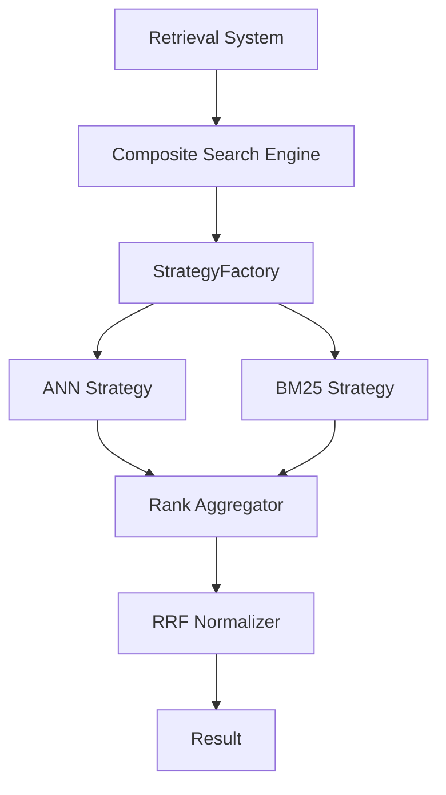

# 후보 구조 설계: 하이브리드 검색 및 점수 통합 (ASR-101, 102)

## 1. 개요
하이브리드 검색(ANN + BM25) 결과를 병합하고 정규화(RRF 등)하는 핵심 엔진 구조에 대한 후보안입니다.

## 2. 후보 1: 전략 기반 검색 엔진 (CA-101)

### 핵심 개념
- **Strategy Pattern** 적용: 검색 알고리즘(ANN, Keyword, Hybrid)을 독립적인 전략 객체로 추상화.
- **Score Interceptor**: 검색 결과가 반환될 때 정규화 및 가중치 계산 로직을 인터셉터 형태로 적용.

### 구조도 (Mermaid)

### 장점
- 동적 전략 선택이 매우 유연함 (Playground 요구사항 충족에 유리).
- 도메인 로직(Aggregator)이 인프라 호출부와 명확히 분리됨.

### 단점
- 검색 소스가 늘어날수록 팩토리 및 인터페이스 관리가 다소 복잡해질 수 있음.

---

## 3. 후보 2: 파이프라인 기반 흐름 제어 (CA-102)

### 핵심 개념
- **Pipe-and-Filter Style** 적용: 검색 요청을 하나의 데이터 스트림으로 보고, 각 검색 단계와 필터링 단계를 파이프로 연결.
- **Middleware**: 각 단계 사이에 공통 처리(Logging, Score Transform)를 수행하는 미들웨어 배치.

### 구조도 (Mermaid)

### 장점
- 처리 단계의 추가/삭제가 매우 직관적임.
- 각 필터가 독립적이므로 유닛 테스트가 용이함.

### 단점
- 단계 간 데이터 스키마 통일이 강제되어 오버헤드가 발생할 수 있음.
- 실시간으로 복잡한 분기 루프를 처리하기에는 전략 패턴보다 다소 경직됨.

## 4. 트레이드오프 분석
| 기준 | CA-101 (Strategy) | CA-102 (Pipe-and-Filter) |
| :--- | :--- | :--- |
| **유연성** | 높음 (동적 교체 용이) | 보통 (순차적 추가 용이) |
| **가독성** | 도메인 로직 중심 | 흐름(Flow) 중심 |
| **성능 오버헤드** | 낮음 | 중간 (파이프 간 데이터 전달) |

## 5. 결론 및 제안
복잡한 검색 파라미터 튜닝이 필수적인 RAGaaS 특성상, 런타임에 동적으로 컴포넌트를 변경하기 쉬운 **CA-101 (Strategy)** 방식이 아키텍처적으로 더 적합할 것으로 판단됩니다.
