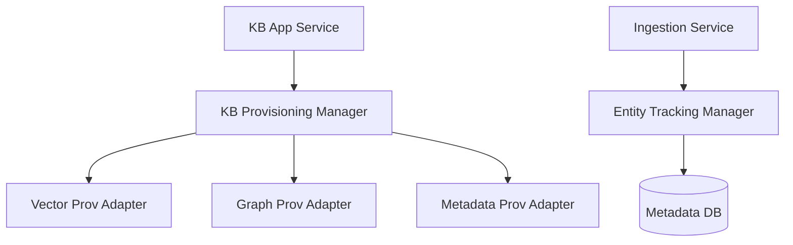

# 후보 구조 설계: 저장소 오케스트레이션 및 프로비저닝 (ASR-103, 106)

## 1. 개요
지식 베이스 생성 시 수반되는 이종 DB(Milvus, Neo4j, MetaDB) 자원 할당 및 트리플 추출 프로세스 관리 구조입니다.

## 2. 후보 1: 추상화된 저장소 프로비저너 (CA-103)

### 핵심 개념
- **Provisioner Interface**: 각 엔진별 프로비저닝 로직을 추상화하여 KB 생성 시 일괄 처리.
- **Entity Mapper**: 마크다운에서 추출된 트리플이 소스 청크(Chunk)와 부모 문서(Document) 정보를 추적할 수 있도록 하는 매핑 관리자.

### 구조도 (Mermaid)

### 장점
- KB 생성 시점의 복잡한 비즈니스 규칙(자원 할당 등)이 캡슐화됨.
- 새로운 저장소(예: 추가 그래프 DB) 도입 시 확장성이 우수함.

### 단점
- 여러 프로비저너 간의 트랜잭션 처리가 복잡함 (분산 환경 리스크).

## 3. 후보 2: 이벤트 기반 비동기 프로비저닝 (대안 제안)

### 핵심 개념
- KB 생성 요청 시 이벤트를 발행하고, 각 엔진용 워커(Worker)가 비동기로 자원을 준비.

### 장점
- 시스템 응답성 향상.

### 단점
- 자원 준비 미완료 상태에서의 문서 업로드 시나리오 등 예외 처리가 가중됨.

## 4. 트레이드오프 분석
현재 시스템 규모에서는 트랜잭션 가시성 확보가 비동기 처리보다 중요하므로, **CA-103 (Synchronous Provisioning Manager)**를 우선 고려합니다.
