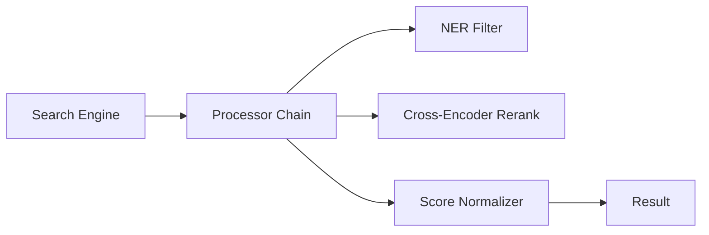

# 후보 구조 설계: 동적 후처리 필터 구조 (ASR-104, 105)

## 1. 개요
리랭커, NER 필터 등 검색 결과 반환 전 거쳐야 하는 다양한 후처리 도구들의 체이닝 및 동적 튜닝 구조입니다.

## 2. 후보 1: 인터셉터 체인 (CA-104)

### 핵심 개념
- **Post-Process Interceptor**: 각 후처리 기능(Rerank, NER, Deduplication)을 인터셉터로 구현.
- **Chain of Responsibility**: 활성화된 필터들을 체인 형태로 연결하여 순차 실행.

### 구조도 (Mermaid)

### 장점
- 필터 순서 변경이 자유로움.
- 개별 필터의 재사용성이 매우 높음.

### 단점
- 필터 간 데이터 공유(예: 이전 필터에서 추출한 엔티티 활용)를 위해 공통 컨텍스트 객체 관리가 필요함.

## 3. 트레이드오프 분석
Playground에서 특정 기능을 On/Off 하거나 파라미터를 조정하는 요구사항(ASR-204)에 가장 부합하는 구조입니다.
