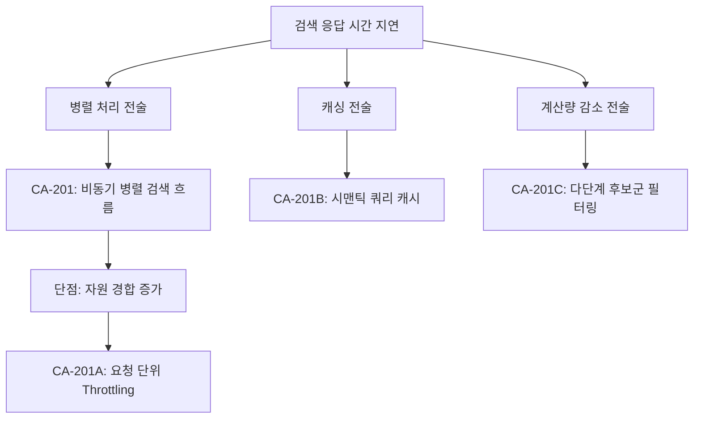

# 성능 분석 및 후보 구조 설계: 하이브리드 검색 응답성 (QS-001)

## 1. 성능 문제 식별 및 분석

### 1.1 성능 시나리오 (QS-001) 요약
- **목표**: 하이브리드 검색(임베딩 + ANN + BM25 + 리랭커)의 전체 응답 시간 최소화.
- **측정 기준**: API 요청 수신부터 최종 결과 반환까지의 T_response.

### 1.2 주요 구조적 병목 지점
- **병목 1 (I/O)**: 외부 모델(Embedding, Rerank) 서버와의 통신 지연.
- **병목 2 (Compute)**: 두 종류의 검색 결과(ANN, BM25)를 결합하고 다량의 문서를 리랭킹하는 작업의 계산 비용.
- **병목 3 (Order)**: 임베딩이 완료되어야 검색을 시작할 수 있는 순차적 실행 구조.

## 2. 설계 과정 마인드 맵 (Performance Tactics)

## 3. 후보 구조 상세 설계

### 후보 1: 비동기 병렬 검색 흐름 (CA-201)
- **핵심 아이디어**: `asyncio` 등을 활용하여 임베딩 연산과 동시에 키워드 검색(BM25)과 같이 임베딩이 불필요한 작업을 즉시 시작.
- **설계 구조**:
    1. 쿼리 수신 즉시 **임베딩 요청**과 **키워드 검색**을 동시 트리거.
    2. 임베딩 완료 직후 **ANN 검색** 실행.
    3. 모든 결과가 수집되는 대로 집계 로직(RRF) 수행.
- **장점**: 전체 대기 시간이 가장 느린 경로(Critical Path) 수준으로 단축됨.
- **단점**: 동시 커넥션 및 CPU 점유율이 일시적으로 상승함.

### 후보 2: 다단계 후보군 필터링 (CA-201C)
- **핵심 아이디어**: 리랭커로 보내는 문서 수를 고정하지 않고, 하위 검색 엔진의 점수 신뢰도에 따라 동적으로 상위 n건만 추출하여 전달.
- **설계 구조**:
    - 검색 결과 중 하위 70%는 유사도 점수가 낮을 경우 리랭킹 단계에서 조기 제외(Short-circuit).
- **장점**: 성능 오버헤드가 가장 큰 리랭킹 연산량을 획기적으로 줄임.
- **단점**: 일부 관련성 높은 문서가 필터링 조건에 의해 누락될 위험(Recall 손실)이 있음.

## 4. 트레이드오프 분석 및 보완 설계

| 후보 ID | 성능 개선 효과 | 복잡도 | 트레이드오프 |
| :--- | :--- | :--- | :--- |
| **CA-201** | **매우 높음** | 보통 | 자원 사용량 증가 |
| **CA-201C** | **높음** | 낮음 | 검색 정확도(Recall)와 성능의 균형 |

### 종속 후보 구조 (CA-201A)
- **목적**: CA-201의 자원 경합 단점 보완.
- **내역**: 동시 검색 요청이 폭주할 경우를 대비하여 세마포어(Semaphore)를 통한 동시 실행 엔진 수 제한.

## 5. 결론
응답 속도가 최우선인 RAGaaS 환경(ASR-201)에서는 **CA-201(병렬 처리)**를 기본 구조로 채택하고, 리소스 한계를 고려한 **CA-201A**를 보완책으로 적용하는 것을 권장합니다.
