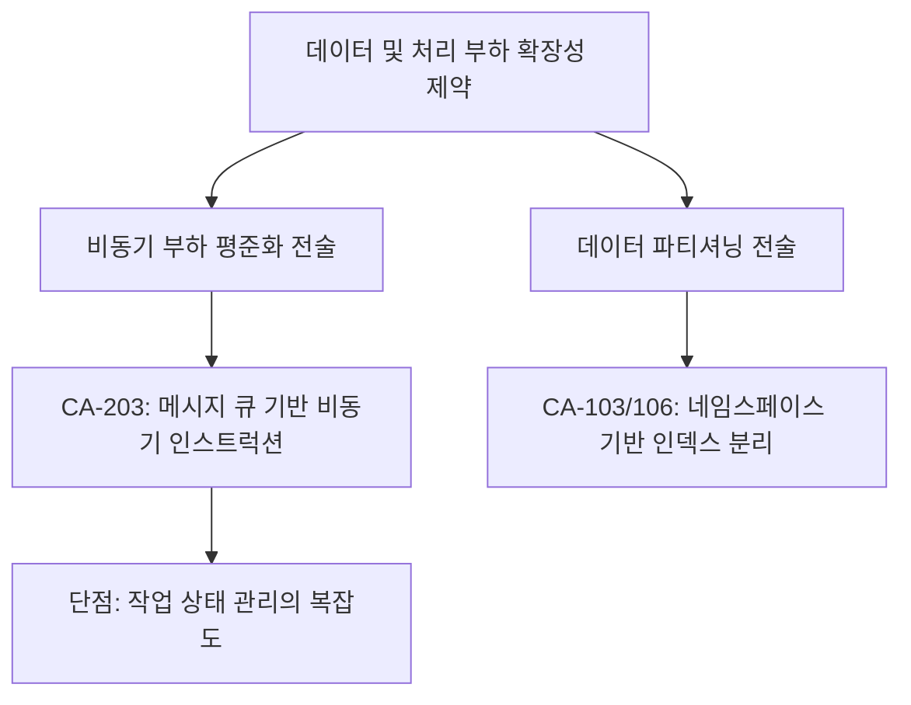

# 확장성 분석 및 후보 구조 설계: 대용량 데이터 및 부하 대응 (QS-002, 005)

## 1. 확장성 문제 식별 및 분석

### 1.1 시나리오 요약
- **QS-002 (대량 추출)**: 1,000페이지 이상의 문서를 업로드할 때 오케스트레이터의 병목 없이 처리 완료.
- **QS-005 (데이터 규모)**: 청크 수가 1,000,000건(1M)에 도달해도 검색 지연 시간이 선형적으로 증가하지 않도록 제어.

### 1.2 주요 구조적 확장 방해 요소
- **병목 1 (Ingestion Lock)**: 문서 처리(파싱 -> 청킹 -> 임베딩 -> 저장)가 단일 프로세스에서 동기적으로 일어날 경우, 대량 문서 처리 시 후속 요청이 모두 차단됨.
- **병목 2 (Flat Index)**: 단일 컬렉션에 모든 데이터를 밀어 넣을 경우, 검색량 증가에 따라 밀버스(Milvus) 인덱스 조회 비용이 기하급수적으로 증가.

## 2. 설계 과정 마인드 맵 (Scalability Tactics)

## 3. 후보 구조 상세 설계

### 후보 1: 메시지 큐 기반 비동기 인스트럭션 (CA-203)
- **핵심 아이디어**: **Queue-based Load Leveling** 적용. API 서버는 요청을 큐(Redis 등)에 적재만 하고, 별도의 워커(Worker)들이 수평적으로 확장(Scale-out)하며 작업을 소모.
- **설계 구조**:
    - **Ingestion Worker Cluster**: 문서 파싱과 임베딩만 전담하는 독립적인 컨테이너들.
    - 부하 증가 시 워커 수만 늘려 처리량(Throughput) 확대.
- **장점**: **QS-002** 만족. 대량 문서가 들어와도 API 서버는 영향을 받지 않고 정상 응답 가능.
- **단점**: 작업 완료 여부를 확인하기 위해 폴링(Polling)이나 웹소켓(WebSocket) 처리가 추가로 필요함.

### 후보 2: 네임스페이스 기반 인덱스 분할 (CA-106)
- **핵심 아이디어**: **Database Federation / Sharding** 유사 전술. 모든 청크를 하나의 인덱스에 넣지 않고, 지식 베이스(KB) 단위로 Milvus 컬렉션을 분리하여 인덱스 크기를 작게 유지.
- **설계 구조**:
    - KB 생성 시점에 전용 컬렉션 할당 (ASR-106 연관).
- **장점**: **QS-005** 만족. 데이터가 1M 건이 되더라도 개별 검색은 작은 인덱스에서 수행되므로 응답 속도 유지.
- **단점**: KB 수가 수천 개로 늘어날 경우 관리 오버헤드 및 메타데이터 관리 비용 증가.

## 4. 트레이드오프 분석 및 보완 설계

| 후보 ID | 확장성 개선 효과 | 복잡도 | 트레이드오프 |
| :--- | :--- | :--- | :--- |
| **CA-203** | **매우 높음** | 높음 | 비동기 상태 관리 비용 |
| **CA-106** | **높음** | 보통 | KB 수 증가에 따른 자원 관리 부담 |

## 5. 결론
대규모 데이터 인입과 안정적인 검색을 위해 **CA-203(워커 분산)**과 **CA-106(KB별 컬렉션 분리)**를 공통 구조로 채택할 것을 제안합니다.
