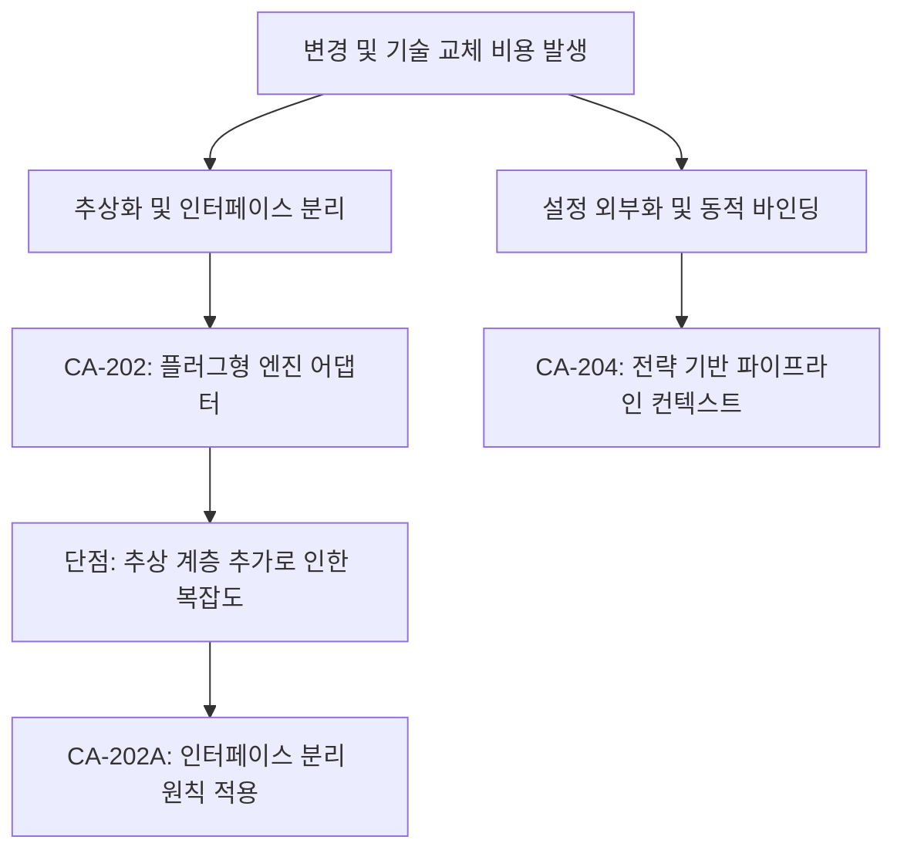

# 변경 용이성 분석 및 후보 구조 설계: 엔진 유연성 및 동적 설정 (QS-003, 007)

## 1. 변경 용이성 문제 식별 및 분석

### 1.1 시나리오 요약
- **QS-003 (엔진 교체)**: 그래프 DB를 Fuseki에서 Neo4j로 교체할 때 핵심 로직 수정 최소화.
- **QS-007 (동적 설정)**: 플레이그라운드에서 변경한 파라미터가 시스템 재시작 없이 즉시 검색 결과에 반영.

### 1.2 주요 구조적 문제
- **문제 1 (직접 의존성)**: 서비스 로직이 특정 DB 클라이언트 라이브러리에 직접 의존할 경우 교체 비용 급증.
- **문제 2 (설정 고착화)**: 검색 파이프라인의 구성(리랭커 사용 여부 등)이 코드 내에 하드코딩되어 있을 경우 실시간 실험 불가.

## 2. 설계 과정 마인드 맵 (Modifiability Tactics)

## 3. 후보 구조 상세 설계

### 후보 1: 플러그형 엔진 어댑터 (CA-202)
- **핵심 아이디어**: **Adapter Pattern**과 **Dependency Injection** 활용. 도메인은 `GraphStorePort` 인터페이스만 알고, 런타임에 특정 엔진(FusekiAdapter 등)을 주입.
- **설계 구조**:
    - `docs/arch/architecture/style.md`에서 정의한 헥사고날 구조를 구체화.
    - 엔진별 전용 언어(SPARQL, Cypher)를 어댑터 내부에서 생성 및 처리.
- **장점**: **QS-003** 만족. 백엔드 교체 시 도메인/애플리케이션 레이어 수정 0건 목표.
- **단점**: 인터페이스가 모든 엔진의 특수 기능을 다 담지 못할 경우 '최소 공통 분모' 이슈 발생 가능.

### 후보 2: 전략 기반 파이프라인 컨텍스트 (CA-204)
- **핵심 아이디어**: 검색 요청(Request) 객체 내에 검색 전략 파라미터를 포함하여 전달하고, 엔진이 이를 해석하여 런타임에 흐름을 결정.
- **설계 구조**:
    - **SearchContext 객체**: `rerank_enabled`, `top_k`, `weight_vector` 등의 필드 포함.
    - **Engine Strategy**: Context 값을 읽어 특정 어댑터나 필터를 동적으로 활성화.
- **장점**: **QS-007** 만족. 서버 재배포 없이 사용자 요청마다 다른 실험 수행 가능.
- **단점**: 요청 객체가 비대해질 수 있음.

## 4. 트레이드오프 분석 및 보완 설계

| 후보 ID | 변경 개선 효과 | 복잡도 | 트레이드오프 |
| :--- | :--- | :--- | :--- |
| **CA-202** | **매우 높음** | 보통 | 엔진별 특화 기능 희생 가능성 |
| **CA-204** | **높음** | 낮음 | 요청 객체 정합성 관리 필요 |

## 5. 결론
시스템의 장기적 유연성을 위해 **CA-202(어댑터 패턴)**를 기반으로 하고, 플레이그라운드 실험을 위해 **CA-204(컨텍스트 전파)**를 결합하여 설계합니다.
