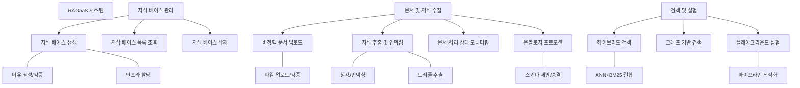

# 기능적 요구사항 (User Stories)

## 개요
이 문서는 RAGaaS(RAG as a Service) 시스템의 상세 Use Case 시나리오로부터 도출된 구체적인 기능적 요구사항을 정의합니다. 각 요구사항은 독립적인 구현 단위인 User Story 형식으로 기술되었으며, 비즈니스 가치와 구현 시급성을 고려하여 우선순위가 설정되었습니다.

## 기능 트리 (Functional Tree)

## 기능 요구사항 상세 (User Stories)

### 1. 지식 베이스 관리 (Knowledge Base Management)

| ID | User Story (As a... I want to... So that...) | 관련 Use Case 및 단계 | 우선순위 |
|:---|:---|:---|:---|
| FR-001 | 시스템 관리자로서, 이름과 설명을 입력하여 새로운 지식 베이스를 생성함으로써 지식 데이터를 독립적으로 관리하기를 원한다. | UC-001 (Step 1) | High |
| FR-002 | 시스템으로서, 지식 베이스 생성 시 이름 중복 여부를 검증하여 데이터 관리의 일관성을 유지하기를 원한다. | UC-001 (Step 2, 2a) | High |
| FR-003 | 시스템으로서, 지식 베이스 생성 시 Milvus 컬렉션과 그래프 파티션을 자동 할당하여 데이터 격리 환경을 구축하기를 원한다. | UC-001 (Step 4, 5) | High |
| FR-004 | 시스템 관리자로서, 생성된 지식 베이스 목록과 요약 정보(문서 수, 상태 등)를 조회하여 시스템 현황을 모니터링하기를 원한다. | UC-002 (Step 1, 4) | High |
| FR-005 | 시스템 관리자로서, 더 이상 필요 없는 특정 지식 베이스의 삭제를 요청하여 시스템 리소스를 효율적으로 관리하기를 원한다. | UC-003 (Step 1) | Medium |
| FR-006 | 시스템으로서, 지식 베이스 삭제 전 최종 확인을 요청하여 관리자의 실수에 의한 데이터 유실을 방지하기를 원한다. | UC-003 (Step 2) | Medium |
| FR-007 | 시스템으로서, 지식 베이스 삭제 시 연관된 모든 데이터(벡터, 그래프, 메타, 원본 파일)를 완전 제거하여 데이터 무결성을 유지하기를 원한다. | UC-003 (Step 4~7) | Medium |

### 2. 문서 및 지식 수집 (Document & Knowledge Ingestion)

| ID | User Story (As a... I want to... So that...) | 관련 Use Case 및 단계 | 우선순위 |
|:---|:---|:---|:---|
| FR-011 | 시스템 관리자로서, PDF, TXT, MD 파일을 특정 지식 베이스에 업로드하여 지식 추출의 원천 데이터를 제공하기를 원한다. | UC-101 (Step 1) | High |
| FR-012 | 시스템으로서, 업로드된 파일의 확장자와 크기를 검증하여 시스템이 처리 가능한 문서만 수집하기를 원한다. | UC-101 (Step 2, 2a) | High |
| FR-013 | 시스템으로서, 업로드된 문서의 초기 상태를 'Pending'으로 등록하여 이후 처리 프로세스를 추적할 수 있기를 원한다. | UC-101 (Step 4) | High |
| FR-014 | 시스템 관리자로서, 업로드된 문서의 처리 상태(Processing, Completed, Error)를 실시간 모니터링하여 성공 여부를 확인하기를 원한다. | UC-103 | High |
| FR-015 | 시스템으로서, 문서 텍스트를 파싱하고 전략에 따라 청킹(Chunking)을 수행하여 검색 가능한 단위로 분할하기를 원한다. | UC-102 (Step 2) | High |
| FR-016 | 시스템으로서, 텍스트 청크를 벡터로 변환하여 Milvus에 인덱싱함으로써 유사도 기반 검색이 가능하게 하기를 원한다. | UC-102 (Step 3, 5) | High |
| FR-017 | 시스템으로서, 텍스트에서 엔티티와 관계를 식별하여 지식 트리플을 추출하고 그래프 DB에 저장함으로써 관계 기반 검색을 지원하기를 원한다. | UC-102 (Step 4, 6) | Medium |
| FR-018 | 시스템 관리자로서, 추출된 지식 그래프 데이터로부터 공통 패턴을 도출하는 온톨로지 프로모션을 실행하여 지식 구조를 규격화하기를 원한다. | UC-104 (Step 1) | Low |
| FR-019 | 시스템으로서, 저장된 트리플 데이터를 분석하여 후보 클래스와 속성 목록을 관리자에게 제안함으로써 지식 모델링을 보조하기를 원한다. | UC-104 (Step 3, 4) | Low |
| FR-020 | 시스템 관리자로서, 제안된 온톨로지 스키마를 검토 및 수정하여 최종 승인함으로써 시스템의 지식 구조를 확정하기를 원한다. | UC-104 (Step 5, 6) | Low |

### 3. 검색 및 실험 (Retrieval & Playground)

| ID | User Story (As a... I want to... So that...) | 관련 Use Case 및 단계 | 우선순위 |
|:---|:---|:---|:---|
| FR-031 | AI 애플리케이션 또는 관리자로서, 벡터(ANN)와 키워드(BM25) 검색이 결합된 하이브리드 검색을 수행하여 정밀한 결과를 얻기를 원한다. | UC-201 (Step 1) | High |
| FR-032 | 시스템으로서, 다양한 검색 결과의 점수를 RRF 및 정규화를 통해 통합하여 사용자에게 일관된 랭킹을 제공하기를 원한다. | UC-201 (Step 5, 6) | High |
| FR-033 | 시스템 관리자로서, SPARQL 또는 Cypher 쿼리를 직접 실행하여 지식 그래프 내의 복잡한 관계 데이터를 탐색하기를 원한다. | UC-202 (Step 1) | Medium |
| FR-034 | 시스템 관리자로서, 플레이그라운드에서 검색 전략과 리랭커, NER 필터 등의 파라미터를 실시간 조정하며 검색 품질을 최적화하기를 원한다. | UC-203 (Step 1~4) | High |
| FR-035 | 시스템으로서, 검색 결과와 함께 단계별 처리 점수(Score Breakdowns)를 가시화하여 검색 과정의 투명성을 제공하기를 원한다. | UC-203 (Step 7) | Medium |
| FR-036 | 시스템으로서, 플레이그라운드 설정에 따라 Cross-Encoder 리랭킹과 패턴 기반 NER 필터링을 후처리로 적용하여 결과 품질을 고도화하기를 원한다. | UC-203 (Step 6) | High |
