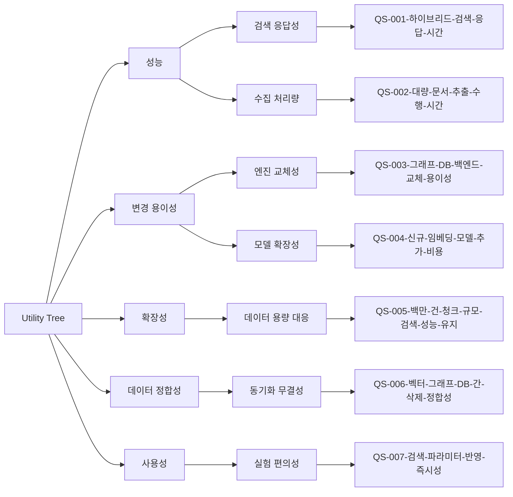

# 품질 시나리오 목록

## 개요

### 목적
RAGaaS 시스템의 비즈니스 목표 달성과 성공적인 운영을 위해 필요한 핵심 품질 요구사항을 식별하고, 아키텍처 설계 결정에 영향을 미치는 주요 품질 시나리오를 정의합니다.

### 생성 기준
- **비즈니스 가치**: 검색 품질 최적화 및 운영 편의성 제공 (Business Driver 반영)
- **아키텍처 영향**: 하이브리드 엔진, 멀티 DB 백엔드, 확장 가능한 파이프라인 설계에 영향을 미치는 시나리오 우선
- **측정 가능성**: 구체적인 상황에서 객관적으로 검증 가능한 지표 설정

## Utility Tree

### 품질 속성 계층 구조

## 품질 시나리오 목록

### QS-001-하이브리드-검색-응답-시간
- **품질 속성**: 성능 (Performance)
- **설명**: AI 애플리케이션이 하이브리드 검색(벡터+키워드)을 요청했을 때 최상위 결과를 반환하는 속도
- **측정 방법**: 단일 질의 요청 시점부터 점수가 계산된 상위 K개 결과 리스트 수신 완료까지의 시간 (End-to-End Latency)

### QS-002-대량-문서-추출-수행-시간
- **품질 속성**: 성능 (Performance)
- **설명**: 100페이지 분량의 PDF 문서 업로드 시 텍스트 파싱, 청킹, 임베딩 및 트리플 추출이 완료되는 속도
- **측정 방법**: 추출 시작 요청 시점부터 모든 벡터 및 트리플 저장 완료 후 상태가 'Completed'로 변경될 때까지의 시간

### QS-003-그래프-DB-백엔드-교체-용이성
- **품질 속성**: 변경 용이성 (Modifiability)
- **설명**: 현재 사용 중인 그래프 DB(예: Fuseki)를 다른 엔진(예: Neo4j)으로 변경할 때 소스 코드의 변경 범위
- **측정 방법**: 특정 그래프 쿼리 로직(Interface 구현체) 변경 시 영향을 받는 기존 모듈의 비율 또는 추상화 인터페이스 수정 필요 여부

### QS-004-신규-임베딩-모델-추가-비용
- **품질 속성**: 변경 용이성 (Modifiability)
- **설명**: 새로운 HuggingFace 임베딩 모델 또는 외부 API 모델을 시스템에 연동하는 데 드는 공수
- **측정 방법**: 설정 파일 업데이트 및 신규 모델 핸들러 클래스 추가만으로 연동이 완료되는지 여부 (기존 검색 엔진 코드 수정 방지)

### QS-005-백만-건-청크-규모-검색-성능-유지
- **품질 속성**: 확장성 (Scalability)
- **설명**: 지식 베이스 내 데이터가 백만 건(1M) 청크 이상으로 증가하더라도 검색 품질 및 속도가 일정 수준을 유지함
- **측정 방법**: 데이터 규모가 10배 증가할 때 검색 응답 시간 증가율 및 하드웨어 자원(메모리) 소비 증가 곡선

### QS-006-벡터-그래프-DB-간-삭제-정합성
- **품질 속성**: 데이터 정합성 (Consistency)
- **설명**: 특정 지식 베이스 또는 문서를 삭제했을 때 벡터 DB와 그래프 DB에서 연관 데이터가 동시에 완벽히 제거됨
- **측정 방법**: 삭제 수행 후 각 DB를 전수 조사하여 삭제되지 않고 남은 고립된 데이터(Orphaned data)가 존재하는지 여부

### QS-007-검색-파라미터-반영-즉시성
- **품질 속성**: 사용성 (Usability)
- **설명**: 플레이그라운드에서 리랭커 끄기, Threshold 조정 등 파라미터를 변경했을 때 검색 결과에 즉시 반영되어야 함
- **측정 방법**: 파라미터 변경 후 검색 실행 시 재인덱싱이나 서버 재시작 없이 설정된 로직이 즉각 적용되는지 여부
