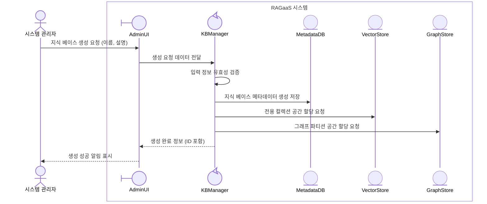

# UC-001-지식 베이스 생성 시스템 구조 분석

## 개요

### Use Case ID
UC-001

### 제목
지식 베이스 생성

## 시퀀스 다이어그램

### 주요 시나리오

```mermaid
sequenceDiagram
  %% primary actor
  actor Admin as 시스템 관리자

  box RAGaaS 시스템
    participant AdminUI@{ "type" : "boundary" }
    participant KBManager@{ "type" : "control" }
    participant MetadataDB@{ "type" : "entity" }
    participant VectorStore@{ "type" : "entity" }
    participant GraphStore@{ "type" : "entity" }
  end
  
  Admin->>AdminUI: 지식 베이스 생성 요청 (이름, 설명)
  AdminUI->>KBManager: 생성 요청 데이터 전달
  KBManager->>KBManager: 입력 정보 유효성 검증
  
  KBManager->>MetadataDB: 지식 베이스 메타데이터 생성 저장
  KBManager->>VectorStore: 전용 컬렉션 공간 할당 요청
  KBManager->>GraphStore: 그래프 파티션 공간 할당 요청
  
  KBManager-->>AdminUI: 생성 완료 정보 (ID 포함)
  AdminUI-->>Admin: 생성 성공 알림 표시
```
