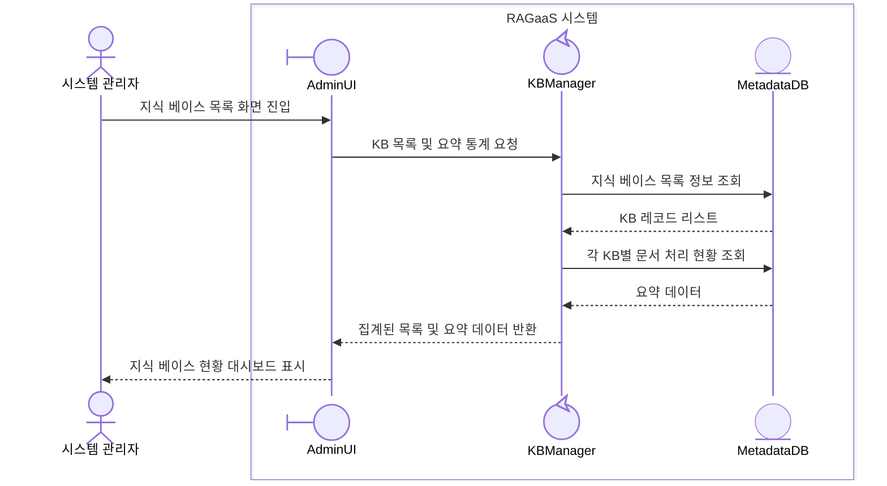

# UC-002-지식 베이스 목록 조회 시스템 구조 분석

## 개요

### Use Case ID
UC-002

### 제목
지식 베이스 목록 조회

## 시퀀스 다이어그램

### 주요 시나리오

```mermaid
sequenceDiagram
  %% primary actor
  actor Admin as 시스템 관리자

  box RAGaaS 시스템
    participant AdminUI@{ "type" : "boundary" }
    participant KBManager@{ "type" : "control" }
    participant MetadataDB@{ "type" : "entity" }
  end
  
  Admin->>AdminUI: 지식 베이스 목록 화면 진입
  AdminUI->>KBManager: KB 목록 및 요약 통계 요청
  
  KBManager->>MetadataDB: 지식 베이스 목록 정보 조회
  MetadataDB-->>KBManager: KB 레코드 리스트
  KBManager->>MetadataDB: 각 KB별 문서 처리 현황 조회
  MetadataDB-->>KBManager: 요약 데이터
  
  KBManager-->>AdminUI: 집계된 목록 및 요약 데이터 반환
  AdminUI-->>Admin: 지식 베이스 현황 대시보드 표시
```
