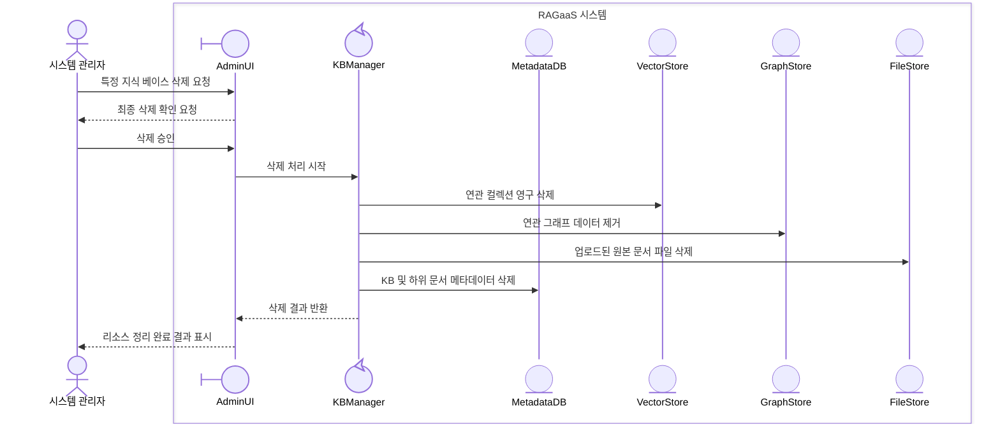

# UC-003-지식 베이스 삭제 시스템 구조 분석

## 개요

### Use Case ID
UC-003

### 제목
지식 베이스 삭제

## 시퀀스 다이어그램

### 주요 시나리오

```mermaid
sequenceDiagram
  %% primary actor
  actor Admin as 시스템 관리자

  box RAGaaS 시스템
    participant AdminUI@{ "type" : "boundary" }
    participant KBManager@{ "type" : "control" }
    participant MetadataDB@{ "type" : "entity" }
    participant VectorStore@{ "type" : "entity" }
    participant GraphStore@{ "type" : "entity" }
    participant FileStore@{ "type" : "entity" }
  end
  
  Admin->>AdminUI: 특정 지식 베이스 삭제 요청
  AdminUI-->>Admin: 최종 삭제 확인 요청
  Admin->>AdminUI: 삭제 승인
  
  AdminUI->>KBManager: 삭제 처리 시작
  
  KBManager->>VectorStore: 연관 컬렉션 영구 삭제
  KBManager->>GraphStore: 연관 그래프 데이터 제거
  KBManager->>FileStore: 업로드된 원본 문서 파일 삭제
  KBManager->>MetadataDB: KB 및 하위 문서 메타데이터 삭제
  
  KBManager-->>AdminUI: 삭제 결과 반환
  AdminUI-->>Admin: 리소스 정리 완료 결과 표시
```
