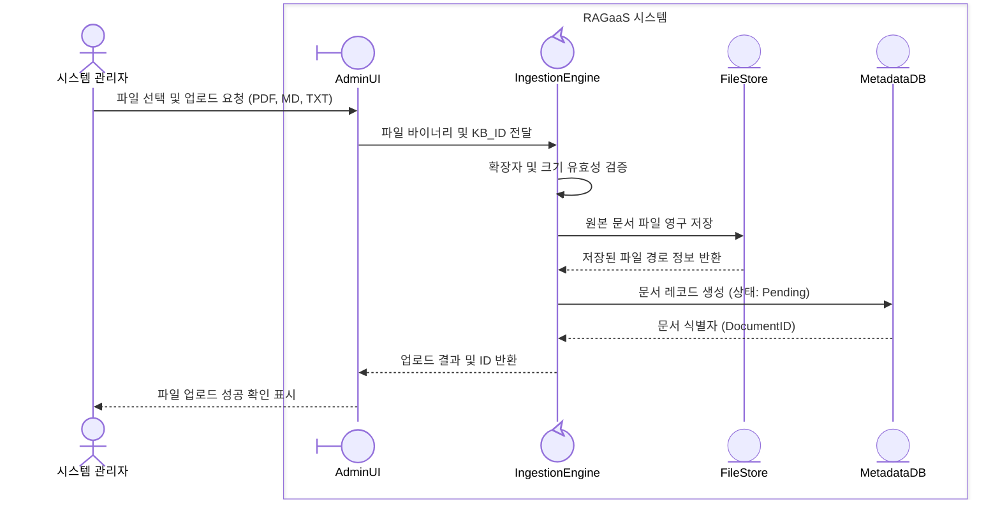

# UC-101-비정형 문서 업로드 시스템 구조 분석

## 개요

### Use Case ID
UC-101

### 제목
비정형 문서 업로드

## 시퀀스 다이어그램

### 주요 시나리오

```mermaid
sequenceDiagram
  %% primary actor
  actor Admin as 시스템 관리자

  box RAGaaS 시스템
    participant AdminUI@{ "type" : "boundary" }
    participant IngestionEngine@{ "type" : "control" }
    participant FileStore@{ "type" : "entity" }
    participant MetadataDB@{ "type" : "entity" }
  end
  
  Admin->>AdminUI: 파일 선택 및 업로드 요청 (PDF, MD, TXT)
  AdminUI->>IngestionEngine: 파일 바이너리 및 KB_ID 전달
  
  IngestionEngine->>IngestionEngine: 확장자 및 크기 유효성 검증
  IngestionEngine->>FileStore: 원본 문서 파일 영구 저장
  FileStore-->>IngestionEngine: 저장된 파일 경로 정보 반환
  
  IngestionEngine->>MetadataDB: 문서 레코드 생성 (상태: Pending)
  MetadataDB-->>IngestionEngine: 문서 식별자 (DocumentID)
  
  IngestionEngine-->>AdminUI: 업로드 결과 및 ID 반환
  AdminUI-->>Admin: 파일 업로드 성공 확인 표시
```
