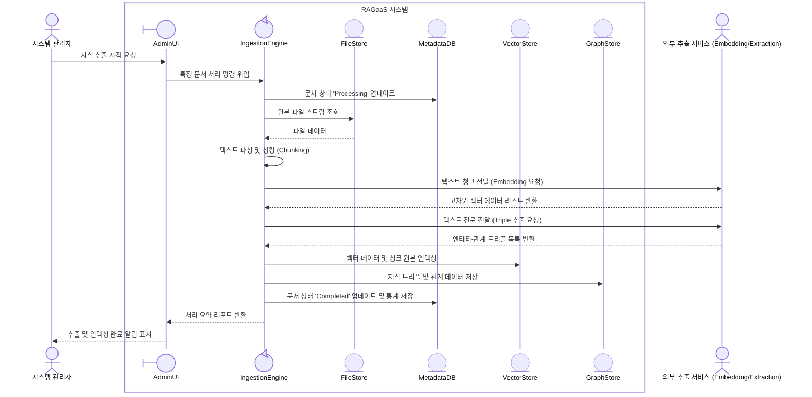

# UC-102-지식 추출 및 인덱싱 시스템 구조 분석

## 개요

### Use Case ID
UC-102

### 제목
지식 추출 및 인덱싱

## 시퀀스 다이어그램

### 주요 시나리오

```mermaid
sequenceDiagram
  %% primary actor
  actor Admin as 시스템 관리자

  box RAGaaS 시스템
    participant AdminUI@{ "type" : "boundary" }
    participant IngestionEngine@{ "type" : "control" }
    participant FileStore@{ "type" : "entity" }
    participant MetadataDB@{ "type" : "entity" }
    participant VectorStore@{ "type" : "entity" }
    participant GraphStore@{ "type" : "entity" }
  end

  %% secondary actor
  actor ExtSvc as 외부 추출 서비스 (Embedding/Extraction)
  
  Admin->>AdminUI: 지식 추출 시작 요청
  AdminUI->>IngestionEngine: 특정 문서 처리 명령 위임
  
  IngestionEngine->>MetadataDB: 문서 상태 'Processing' 업데이트
  IngestionEngine->>FileStore: 원본 파일 스트림 조회
  FileStore-->>IngestionEngine: 파일 데이터
  
  IngestionEngine->>IngestionEngine: 텍스트 파싱 및 청킹 (Chunking)
  
  IngestionEngine->>ExtSvc: 텍스트 청크 전달 (Embedding 요청)
  ExtSvc-->>IngestionEngine: 고차원 벡터 데이터 리스트 반환
  
  IngestionEngine->>ExtSvc: 텍스트 전문 전달 (Triple 추출 요청)
  ExtSvc-->>IngestionEngine: 엔티티-관계 트리플 목록 반환
  
  IngestionEngine->>VectorStore: 벡터 데이터 및 청크 원본 인덱싱
  IngestionEngine->>GraphStore: 지식 트리플 및 관계 데이터 저장
  
  IngestionEngine->>MetadataDB: 문서 상태 'Completed' 업데이트 및 통계 저장
  
  IngestionEngine-->>AdminUI: 처리 요약 리포트 반환
  AdminUI-->>Admin: 추출 및 인덱싱 완료 알림 표시
```
