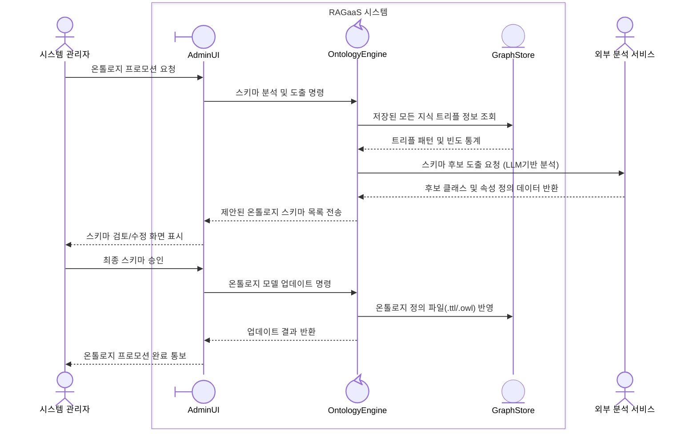

# UC-104-온톨로지 프로모션 시스템 구조 분석

## 개요

### Use Case ID
UC-104

### 제목
온톨로지 프로모션 (Ontology Promotion)

## 시퀀스 다이어그램

### 주요 시나리오

```mermaid
sequenceDiagram
  %% primary actor
  actor Admin as 시스템 관리자

  box RAGaaS 시스템
    participant AdminUI@{ "type" : "boundary" }
    participant OntologyEngine@{ "type" : "control" }
    participant GraphStore@{ "type" : "entity" }
  end

  %% secondary actor
  actor ExtSvc as 외부 분석 서비스
  
  Admin->>AdminUI: 온톨로지 프로모션 요청
  AdminUI->>OntologyEngine: 스키마 분석 및 도출 명령
  
  OntologyEngine->>GraphStore: 저장된 모든 지식 트리플 정보 조회
  GraphStore-->>OntologyEngine: 트리플 패턴 및 빈도 통계
  
  OntologyEngine->>ExtSvc: 스키마 후보 도출 요청 (LLM기반 분석)
  ExtSvc-->>OntologyEngine: 후보 클래스 및 속성 정의 데이터 반환
  
  OntologyEngine-->>AdminUI: 제안된 온톨로지 스키마 목록 전송
  AdminUI-->>Admin: 스키마 검토/수정 화면 표시
  
  Admin->>AdminUI: 최종 스키마 승인
  AdminUI->>OntologyEngine: 온톨로지 모델 업데이트 명령
  
  OntologyEngine->>GraphStore: 온톨로지 정의 파일(.ttl/.owl) 반영
  
  OntologyEngine-->>AdminUI: 업데이트 결과 반환
  AdminUI-->>Admin: 온톨로지 프로모션 완료 통보
```
