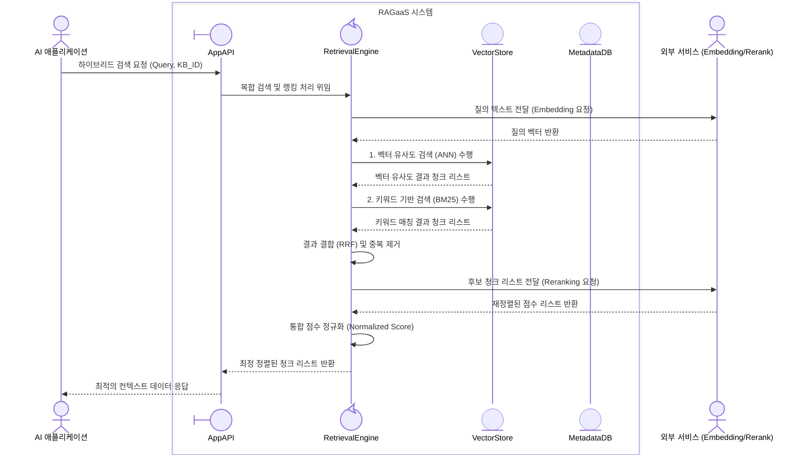

# UC-201-하이브리드 검색 실행 시스템 구조 분석

## 개요

### Use Case ID
UC-201

### 제목
하이브리드 검색 실행

## 시퀀스 다이어그램

### 주요 시나리오

```mermaid
sequenceDiagram
  %% primary actor
  actor App as AI 애플리케이션

  box RAGaaS 시스템
    participant AppAPI@{ "type" : "boundary" }
    participant RetrievalEngine@{ "type" : "control" }
    participant VectorStore@{ "type" : "entity" }
    participant MetadataDB@{ "type" : "entity" }
  end

  %% secondary actor
  actor ExtSvc as 외부 서비스 (Embedding/Rerank)
  
  App->>AppAPI: 하이브리드 검색 요청 (Query, KB_ID)
  AppAPI->>RetrievalEngine: 복합 검색 및 랭킹 처리 위임
  
  RetrievalEngine->>ExtSvc: 질의 텍스트 전달 (Embedding 요청)
  ExtSvc-->>RetrievalEngine: 질의 벡터 반환
  
  RetrievalEngine->>VectorStore: 1. 벡터 유사도 검색 (ANN) 수행
  VectorStore-->>RetrievalEngine: 벡터 유사도 결과 청크 리스트
  
  RetrievalEngine->>VectorStore: 2. 키워드 기반 검색 (BM25) 수행
  VectorStore-->>RetrievalEngine: 키워드 매칭 결과 청크 리스트
  
  RetrievalEngine->>RetrievalEngine: 결과 결합 (RRF) 및 중복 제거
  
  RetrievalEngine->>ExtSvc: 후보 청크 리스트 전달 (Reranking 요청)
  ExtSvc-->>RetrievalEngine: 재정렬된 점수 리스트 반환
  
  RetrievalEngine->>RetrievalEngine: 통합 점수 정규화 (Normalized Score)
  
  RetrievalEngine-->>AppAPI: 최정 정렬된 청크 리스트 반환
  AppAPI-->>App: 최적의 컨텍스트 데이터 응답
```
