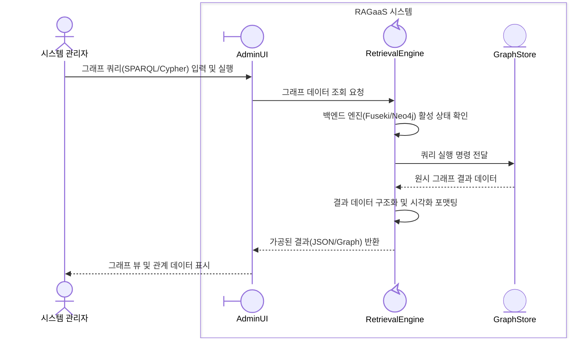

# UC-202-그래프 기반 검색 실행 시스템 구조 분석

## 개요

### Use Case ID
UC-202

### 제목
그래프 기반 검색 실행

## 시퀀스 다이어그램

### 주요 시나리오

```mermaid
sequenceDiagram
  %% primary actor
  actor User as 시스템 관리자

  box RAGaaS 시스템
    participant AdminUI@{ "type" : "boundary" }
    participant RetrievalEngine@{ "type" : "control" }
    participant GraphStore@{ "type" : "entity" }
  end

  User->>AdminUI: 그래프 쿼리(SPARQL/Cypher) 입력 및 실행
  AdminUI->>RetrievalEngine: 그래프 데이터 조회 요청
  
  RetrievalEngine->>RetrievalEngine: 백엔드 엔진(Fuseki/Neo4j) 활성 상태 확인
  
  RetrievalEngine->>GraphStore: 쿼리 실행 명령 전달
  GraphStore-->>RetrievalEngine: 원시 그래프 결과 데이터
  
  RetrievalEngine->>RetrievalEngine: 결과 데이터 구조화 및 시각화 포맷팅
  
  RetrievalEngine-->>AdminUI: 가공된 결과(JSON/Graph) 반환
  AdminUI-->>User: 그래프 뷰 및 관계 데이터 표시
```
