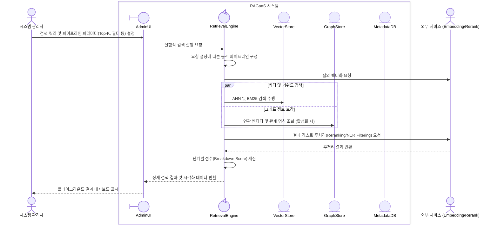

# UC-203-검색 파이프라인 실험 시스템 구조 분석

## 개요

### Use Case ID
UC-203

### 제목
검색 파이프라인 실험 (Playground)

## 시퀀스 다이어그램

### 주요 시나리오

```mermaid
sequenceDiagram
  %% primary actor
  actor Admin as 시스템 관리자

  box RAGaaS 시스템
    participant AdminUI@{ "type" : "boundary" }
    participant RetrievalEngine@{ "type" : "control" }
    participant VectorStore@{ "type" : "entity" }
    participant GraphStore@{ "type" : "entity" }
    participant MetadataDB@{ "type" : "entity" }
  end

  %% secondary actor
  actor ExtSvc as 외부 서비스 (Embedding/Rerank)
  
  Admin->>AdminUI: 검색 쿼리 및 파이프라인 파라미터(Top-K, 필터 등) 설정
  AdminUI->>RetrievalEngine: 실험적 검색 실행 요청
  
  RetrievalEngine->>RetrievalEngine: 요청 설정에 따른 동적 파이프라인 구성
  
  RetrievalEngine->>ExtSvc: 질의 벡터화 요청
  
  par 벡터 및 키워드 검색
    RetrievalEngine->>VectorStore: ANN 및 BM25 검색 수행
  and 그래프 정보 보강
    RetrievalEngine->>GraphStore: 연관 엔티티 및 관계 명칭 조회 (활성화 시)
  end
  
  RetrievalEngine->>ExtSvc: 결과 리스트 후처리(Reranking/NER Filtering) 요청
  ExtSvc-->>RetrievalEngine: 후처리 결과 반환
  
  RetrievalEngine->>RetrievalEngine: 단계별 점수(Breakdown Score) 계산
  
  RetrievalEngine-->>AdminUI: 상세 검색 결과 및 시각화 데이터 반환
  AdminUI-->>Admin: 플레이그라운드 결과 대시보드 표시
```
