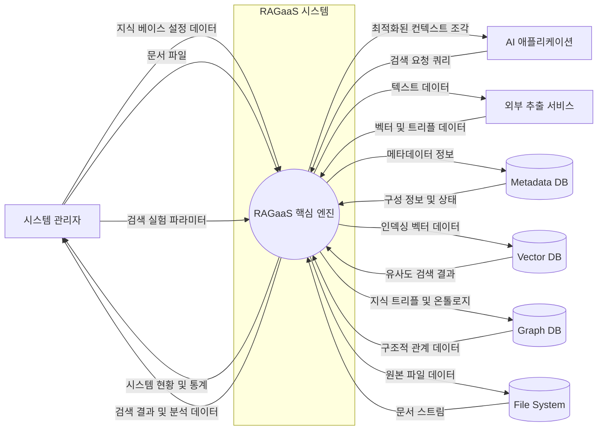

# 시스템 Context 모델

## 개요

### 목적
RAGaaS 통합 관리 시스템의 시스템 경계와 외부 엔티티, 데이터 저장소 및 주요 프로세스 간의 상호작용을 정의하고, 데이터의 흐름을 시각화하여 시스템의 전체 맥락을 파악합니다.

### 컴포넌트 분류 체계
- **Process**: 사용자 또는 외부 시스템과의 인터페이스 및 핵심 비즈니스 로직 처리 (BCE: Boundary, Control)
- **Data Flow**: 컴포넌트 간에 교환되는 정보의 흐름 (명사형)
- **Data Store**: 영속적으로 관리되는 데이터의 집합 (BCE: Entity)
- **External Entity**: 시스템 외부에서 데이터를 공급하거나 소비하는 주체 (Actor, External System)

## 시스템 컨텍스트 모델

## Process (System)

### RAGaaS 핵심 엔진
- **역할**: 지식 베이스 관리, 문서 처리 파이프라인 제어, 하이브리드 검색 수행 및 온톨로지 관리의 핵심 로직을 담당합니다.
- **책임**:
    - **지식 베이스 관리**: 네임스페이스 및 저장소 할당/삭제 (KBManager)
    - **지식 수집 제어**: 문서 처리 상태 관리 및 변환 프로세스 오케스트레이션 (IngestionEngine)
    - **하이브리드 검색**: 벡터/키워드/그래프 검색 결합 및 랭킹 (RetrievalEngine)
    - **지식 구조화**: 온톨로지 분석 및 스키마 업데이트 (OntologyEngine)
- **관련 Use Case**: UC-001, UC-002, UC-003, UC-101, UC-102, UC-104, UC-201, UC-202, UC-203

## External Entity

### 시스템 관리자 (Admin)
- **역할**: 시스템 설정, 문서 업로드 및 검색 품질 최적화를 담당하는 운영자입니다.
- **교환 정보**: 지식 베이스 설정 데이터, 문서 파일, 실험 파라미터, 시스템 통계 리포트.
- **관련 Use Case**: UC-001, UC-002, UC-003, UC-101, UC-104, UC-203

### AI 애플리케이션 (AIApp)
- **역할**: 지식 베이스에 질문을 던져 필요한 컨텍스트를 획득하는 클라이언트 서비스입니다.
- **교환 정보**: 검색 요청 쿼리, 최적화된 컨텍스트 조각(텍스트 청크).
- **관련 Use Case**: UC-201, UC-202

### 외부 추출 서비스 (ExtSvc)
- **역할**: 텍스트를 고차원 벡터로 변환(Embedding)하거나 의미론적 트리플(Entity-Relation)을 추출하는 외부 API입니다.
- **교환 정보**: 텍스트 데이터, 벡터 리스트, 지식 트리플 목록.
- **관련 Use Case**: UC-102

## Data Store

### Metadata DB (MetaDB)
- **역할**: 지식 베이스 설정, 문서 관리 상태 등을 저장하는 메타데이터 저장소입니다.
- **관리 데이터**: KB 메타데이터, 문서 처리 상태, 파일 경로 정보.
- **관련 Use Case**: UC-001, UC-002, UC-101, UC-102

### Vector DB (VectorDB)
- **역할**: 인덱싱된 텍스트 청크의 벡터 데이터를 저장하고 유사도 검색을 수행합니다.
- **관리 데이터**: 고차원 밀집 벡터, 텍스트 청크 원본/참조.
- **관련 Use Case**: UC-102, UC-201, UC-203

### Graph DB (GraphDB)
- **역할**: 지식 트리플(S-P-O)과 온톨로지 스키마를 저장하고 그래프 쿼리를 처리합니다.
- **관리 데이터**: 지식 트리플, 엔티티 속성, 온톨로지 정의(.ttl, .owl).
- **관련 Use Case**: UC-102, UC-104, UC-202, UC-203

### File System (FileStore)
- **역할**: 업로드된 원본 비정형 문서를 파일 형태로 안전하게 보관합니다.
- **관리 데이터**: PDF, TXT, Markdown 파일 원본.
- **관련 Use Case**: UC-101, UC-102, UC-003
