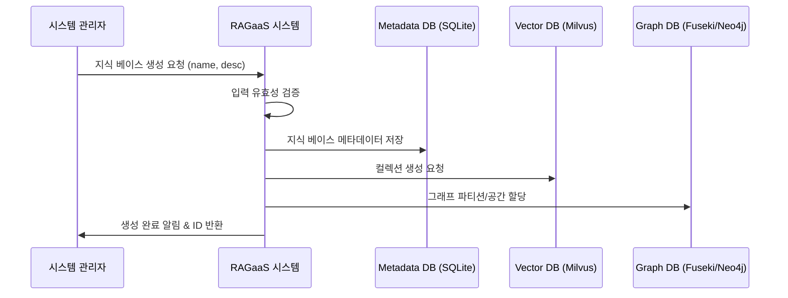

# UC-001-지식 베이스 생성

## 개요

### Use Case ID
UC-001

### 제목
지식 베이스 생성

### 설명
시스템 관리자가 지식 데이터를 독립적으로 관리하기 위한 새로운 지식 베이스(저장소)를 생성한다. 이 과정에서 벡터 데이터 DB(Milvus) 및 그래프 DB(Fuseki/Neo4j)의 해당 영역이 논리적으로 할당된다.

## 액터

### Primary Actor
시스템 관리자
- **역할**: RAG 및 KG 시스템 운영 및 관리
- **설명**: 지식 지형을 구축하고 문서 수집을 주도하는 운영 주체

## 사전조건
- 시스템 관리자가 관리자 대시보드에 접속해 있어야 한다.

## 사후조건
- 새로운 지식 베이스가 생성되고 메타데이터 DB에 등록된다.
- Milvus 컬렉션 및 그래프 저장 파티션이 준비된다.

## 주요 시나리오

1. 시스템 관리자가 시스템에게 새로운 지식 베이스 생성을 요청한다. (이름, 설명 포함)
2. 시스템은 입력된 정보의 유효성을 검증한다.
3. 시스템은 메타데이터 데이터베이스에 지식 베이스 정보를 저장한다.
4. 시스템은 벡터 데이터베이스(Milvus)에 해당 지식 베이스 전용 컬렉션을 생성한다.
5. 시스템은 그래프 데이터베이스(Fuseki/Neo4j)에 지식 저장 공간을 할당한다.
6. 시스템은 시스템 관리자에게 생성 완료 결과와 지식 베이스 식별자(ID)를 반환한다.

### 시나리오 다이어그램

## 대안 시나리오

### 2a. 중복된 이름 확인
입력된 지식 베이스 이름이 이미 존재하는 경우

2a.1. 시스템은 이름 중복 오류를 확인한다.
2a.2. 시스템은 시스템 관리자에게 중복 오류 메시지를 반환한다.

## 예외 시나리오

### E1. 인프라 연결 오류
벡터 또는 그래프 데이터베이스 연결에 실패한 경우

E1.1. 시스템은 연결 실패 로그를 기록한다.
E1.2. 시스템은 시스템 관리자에게 인프라 오류 메시지를 반환하고 생성을 취소한다.

## 관련 Use Case
- UC-002: 지식 베이스 목록 조회 (생성 후 목록에서 확인 가능)

## 비고
- 지식 베이스 삭제(UC-003) 시 모든 연관된 인프라 데이터가 삭제되어야 함을 고려해야 함.
