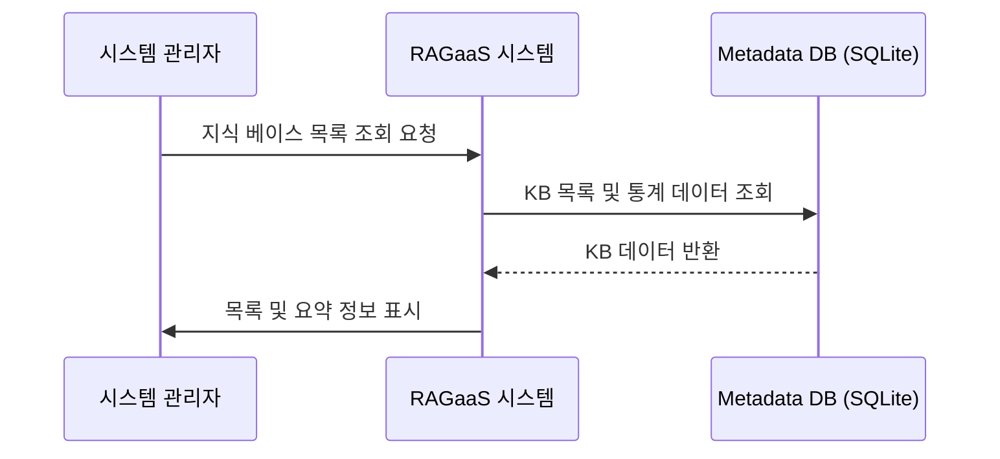

# UC-002-지식 베이스 목록 조회

## 개요

### Use Case ID
UC-002

### 제목
지식 베이스 목록 조회

### 설명
시스템 관리자가 현재 시스템에 생성된 모든 지식 베이스의 목록과 각 지식 베이스의 요약 정보(문서 수, 생성일 등)를 확인한다.

## 액터

### Primary Actor
시스템 관리자
- **역할**: 시스템 운영 현황 파악
- **설명**: 구축된 지식 인프라의 전체 현황을 모니터링함

## 사전조건
- 시스템 관리자가 관리자 대시보드에 접속해 있어야 한다.

## 사후조건
- 시스템에 등록된 지식 베이스 목록이 화면에 표시된다.

## 주요 시나리오

1. 시스템 관리자가 시스템에게 지식 베이스 목록 조회를 요청한다.
2. 시스템은 메타데이터 데이터베이스에서 지식 베이스 목록을 검색한다.
3. 시스템은 각 지식 베이스별 연결된 문서 수 및 상태 통계를 집계한다.
4. 시스템은 시스템 관리자에게 지식 베이스 목록과 요약 정보를 반환한다.

### 시나리오 다이어그램

## 대안 시나리오

### 2a. 데이터가 없는 경우
생성된 지식 베이스가 하나도 없는 경우

2a.1. 시스템은 빈 목록 결과와 함께 '생성된 지식 베이스가 없습니다'라는 안내 메시지를 반환한다.

## 예외 시나리오

### E1. 데이터베이스 접속 실패
메타데이터 DB 연결 오류가 발생한 경우

E1.1. 시스템은 데이터베이스 서버 연결 끊김 오류 메시지를 반환한다.

## 관련 Use Case
- UC-001: 지식 베이스 생성 (생성 후 목록에서 확인)
- UC-003: 지식 베이스 삭제 (목록에서 대상을 선택하여 삭제)
