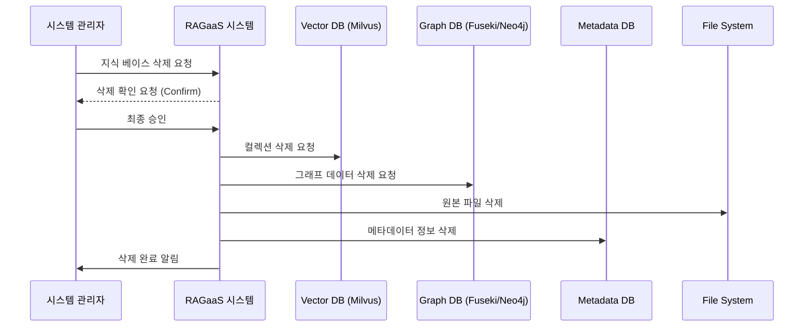

# UC-003-지식 베이스 삭제

## 개요

### Use Case ID
UC-003

### 제목
지식 베이스 삭제

### 설명
특정 지식 베이스를 영구적으로 삭제한다. 이 과정에서 해당 지식 베이스와 관련된 메타데이터, 벡터 데이터(Milvus), 그래프 데이터(Fuseki/Neo4j) 및 원본 문서가 모두 제거된다.

## 액터

### Primary Actor
시스템 관리자
- **역할**: 리소스 정리 및 데이터 관리
- **설명**: 더 이상 필요 없는 지식 자산을 시스템에서 완전히 제거함

## 사전조건
- 시스템 관리자가 지식 베이스 목록 화면에서 삭제할 대상을 선택해야 한다.

## 사후조건
- 메타데이터 DB에서 해당 지식 베이스 레코드가 삭제된다.
- Milvus 컬렉션 및 그래프 저장 파티션이 삭제된다.
- 관련 원본 파일들이 파일 시스템에서 삭제된다.

## 주요 시나리오

1. 시스템 관리자가 특정 지식 베이스의 삭제를 요청한다.
2. 시스템은 관리자에게 최종 삭제 확인(Confirm)을 요청한다.
3. 시스템 관리자가 삭제를 최종 승인한다.
4. 시스템은 벡터 데이터베이스(Milvus)에서 해당 지식 베이스의 컬렉션을 삭제한다.
5. 시스템은 그래프 데이터베이스(Fuseki/Neo4j)에서 해당 지식 데이터를 삭제한다.
6. 시스템은 메타데이터 데이터베이스에서 지식 베이스 및 문서 정보를 삭제한다.
7. 시스템은 파일 시스템에서 업로드된 원본 문서들을 삭제한다.
8. 시스템은 시스템 관리자에게 삭제 완료 결과를 반환한다.

### 시나리오 다이어그램

## 예외 시나리오

### E1. 일부 자원 삭제 실패
네트워크 불안정으로 인해 벡터 DB 또는 그래프 DB 삭제 명령이 실패한 경우

E1.1. 시스템은 삭제 실패한 자원 목록을 로그에 기록한다.
E1.2. 시스템은 시스템 관리자에게 '완전 삭제 실패' 알림을 보내고, 수동 정리가 필요할 수 있음을 알린다.

## 관련 Use Case
- UC-002: 지식 베이스 목록 조회 (목록에서 삭제 요청 시작)
