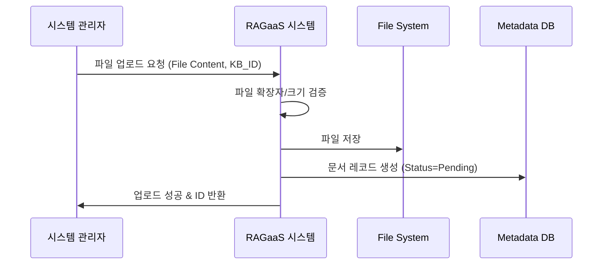

# UC-101-비정형 문서 업로드

## 개요

### Use Case ID
UC-101

### 제목
비정형 문서 업로드

### 설명
시스템 관리자가 지식 추출의 원천이 되는 로컬 파일(PDF, TXT, Markdown 등)을 시스템에 업로드하여 저정한다.

## 액터

### Primary Actor
시스템 관리자
- **역할**: 지식 공급자
- **설명**: 외부의 비정형 정보를 시스템에 주입하는 역할

## 사전조건
- 파일을 업로드할 대상 지식 베이스가 선택되어 있어야 한다.

## 사후조건
- 업로드된 파일이 시스템 저장소(파일 시스템)에 저장된다.
- 메타데이터 DB에 문서의 초기 상태(Pending)가 등록된다.

## 주요 시나리오

1. 시스템 관리자가 업로드할 파일(PDF, TXT, MD 등)을 선택하고 전송을 요청한다.
2. 시스템은 파일 확장자 및 크기를 검증한다.
3. 시스템은 파일을 서버의 지정된 수집 경로(Upload Directory)에 저장한다.
4. 시스템은 메타데이터 데이터베이스에 문서 정보(이름, 경로, 상태:Pending)를 생성한다.
5. 시스템은 시스템 관리자에게 업로드 성공 및 문서 ID를 반환한다.

### 시나리오 다이어그램

## 대안 시나리오

### 2a. 지원하지 않는 파일 형식
허용되지 않은 확장자(예: .exe, .zip)를 업로드한 경우

2a.1. 시스템은 지원하지 않는 파일 형식이라는 오류 메시지를 반환한다.
2a.2. 시스템은 업로드를 중단한다.

## 예외 시나리오

### E1. 저장소 용량 부족
서버 파일 시스템의 디스크 용량이 가득 찬 경우

E1.1. 시스템은 저장 공간 부족 오류를 반환한다.
E1.2. 시스템은 메타데이터 등록을 취소한다.

## 관련 Use Case
- UC-102: 지식 추출 및 인덱싱 (업로드된 파일을 처리함)
- UC-103: 문서 처리 상태 모니터링 (업로드된 문서의 상태 확인)
