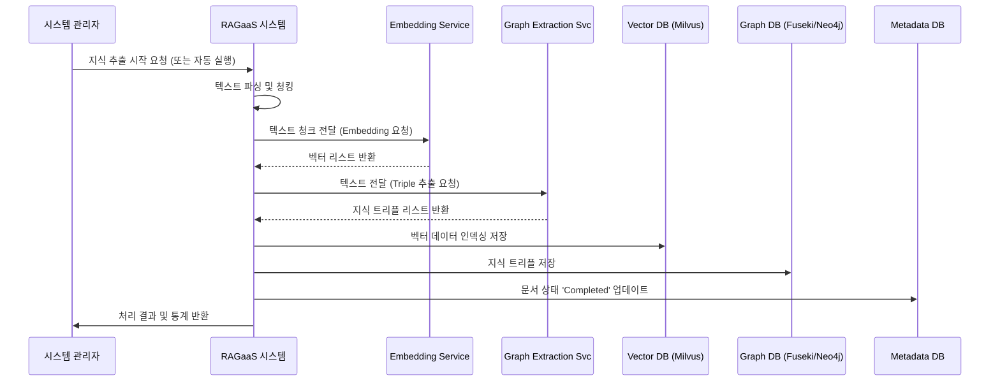

# UC-102-지식 추출 및 인덱싱

## 개요

### Use Case ID
UC-102

### 제목
지식 추출 및 인덱싱

### 설명
업로드된 비정형 문서로부터 유의미한 정보를 추출하여 벡터 형태(검색용)와 그래프 형태(지식 관계용)로 변환하여 각각의 데이터베이스에 저장하는 핵심 프로세스이다.

## 액터

### Primary Actor
시스템 (자동 실행) 또는 시스템 관리자 (명시적 요청)
- **역할**: 데이터 처리 엔진
- **설명**: 업로드된 원본 문서를 처리 가능한 지식 형태로 가공함

### Secondary Actor
Embedding Service, Graph Extraction Service
- **역할**: 정보 변환기
- **설명**: 텍스트를 벡터로 변환(Embedding)하거나, 엔티티-관계를 추출(Graph)함

## 사전조건
- UC-101(비정형 문서 업로드)이 완료되어 시스템에 원본 파일이 존재해야 한다.
- 처리 대상 지식 베이스가 활성화된 상태여야 한다.

## 사후조건
- 문서의 텍스트가 청크 단위로 벡터 DB(Milvus)에 저장된다.
- 문서에서 추출된 트리플(엔티티-관계-엔티티) 정보가 그래프 DB(Fuseki/Neo4j)에 저장된다.
- 문서 처리 상태가 'Completed'로 업데이트된다.

## 주요 시나리오

1. 시스템(또는 관리자)이 업로드된 특정 문서의 지식 추출 가공을 시작한다.
2. 시스템은 문서의 텍스트를 파싱하고 정해진 전략에 따라 청킹(Chunking)을 수행한다.
3. 시스템은 추출된 텍스트 청크를 Embedding Service에게 전달하여 벡터 변환을 요청한다.
4. 시스템은 파싱된 텍스트 내에서 실체(Entity)와 관계(Relation)를 식별하여 지식 트리플을 추출한다.
5. 시스템은 생성된 벡터 데이터를 벡터 데이터베이스(Milvus)에 인덱싱한다.
6. 시스템은 추출된 지식 트리플을 그래프 데이터베이스(Fuseki/Neo4j)에 저장한다.
7. 시스템은 메타데이터 데이터베이스에 문서 처리 완료 상태를 저장한다.
8. 시스템은 시스템 관리자에게 처리 완료 및 통계(청크 수, 트리플 수 등)를 반환한다.

### 시나리오 다이어그램

## 대안 시나리오

### 4a. 그래프 추출 실패 (선택 사항)
시스템 설정에 따라 그래프 추출을 생략하거나 실패하더라도 벡터 인덱싱을 진행하는 경우

4a.1. 시스템은 그래프 추출 단계에서 발생한 경고를 로그에 기록한다.
4a.2. 시스템은 5번 단계(벡터 인덱싱)로 건너뛰어 처리를 계속한다.

## 예외 시나리오

### E1. 텍스트 추출/파싱 실패
문서 형식이 손상되었거나 암호화되어 텍스트를 읽을 수 없는 경우

E1.1. 시스템은 처리 상태를 'Error'로 변경한다.
E1.2. 시스템은 시스템 관리자에게 문서 파싱 실패 알림을 보낸다.

## 관련 Use Case
- UC-103: 문서 처리 상태 모니터링
- UC-203: 검색 파이프라인 실험 (인덱싱된 데이터를 테스트함)

## 비고
- 이 과정은 리소스 소모가 크며, 대량의 문서 처리 시 순차적 또는 병렬적 부하 관리가 필요함.
- 지식 추출 방식은 설정된 온톨로지 정의에 따라 달라질 수 있음.
