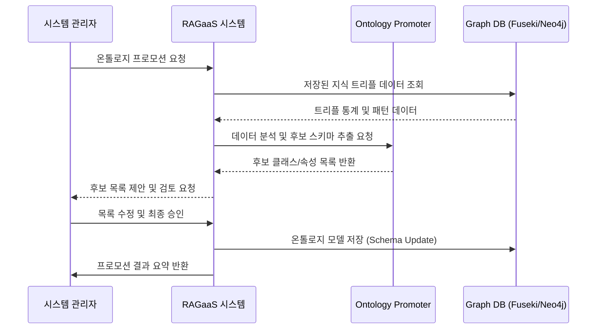

# UC-104-온톨로지 프로모션

## 개요

### Use Case ID
UC-104

### 제목
온톨로지 프로모션 (Ontology Promotion)

### 설명
추출된 개별 지식 트리플(Knowledge Graph) 데이터로부터 공통된 패턴이나 스키마를 도출하여 시스템 전체 또는 지식 베이스 단위의 상위 지식 구조인 온톨로지(Ontology)를 생성하거나 업데이트한다.

## 액터

### Primary Actor
시스템 관리자
- **역할**: 지식 모델링 전문가
- **설명**: 수집된 데이터를 바탕으로 시스템의 지식 구조를 규격화함

### Secondary Actor
Ontology Promoter (Service)
- **역할**: 지식 추상화 엔진
- **설명**: 개별 인스턴스 데이터로부터 클래스, 속성 등의 스키마 정보를 추출/승격함

## 사전조건
- 지식 베이스에 유의미한 양의 지식 트리플(KG) 데이터가 저장되어 있어야 한다.
- 관리자 화면에서 '온톨로지 관리' 메뉴에 접속해 있어야 한다.

## 사후조건
- 새로운 또는 업데이트된 온톨로지 파일(.owl, .ttl 등)이 생성되어 Fuseki/Neo4j에 등록된다.
- 향후 지식 추출 시 이 온톨로지 스키마가 가이드라인으로 활용된다.

## 주요 시나리오

1. 시스템 관리자가 특정 지식 베이스에 대한 '온톨로지 프로모션'을 요청한다.
2. 시스템은 현재 저장된 지식 트리플 데이터의 통계와 패턴을 분석한다. (엔티티 타입, 관계 빈도 등)
3. 시스템은 데이터로부터 도출된 후보 클래스(Classes)와 속성(Properties) 목록을 생성한다.
4. 시스템은 생성된 후보 목록을 시스템 관리자에게 제안한다.
5. 시스템 관리자는 제안된 목록을 검토, 수정 및 승인한다.
6. 시스템은 최종 승인된 구조를 온톨로지 모델로 확정하고 그래프 데이터베이스의 스키마 영역에 저장한다.
7. 시스템은 시스템 관리자에게 온톨로지 프로모션 완료 및 요약 정보를 반환한다.

### 시나리오 다이어그램

## 대안 시나리오

### 5a. 자동 프로모션
관리자 검토 없이 시스템이 정해진 규칙에 따라 자동으로 스키마를 승격하는 경우

5a.1. 시스템은 신뢰도가 높은 상위 패턴만을 선택하여 즉시 온톨로지에 반영한다.
5a.2. 시스템은 처리 결과를 시스템 관리자에게 통보한다.

## 예외 시나리오

### E1. 데이터 부족
분석할 지식 트리플 데이터가 너무 적어 온톨로지 도출이 불가능한 경우

E1.1. 시스템은 데이터 부족 오류를 출력한다.
E1.2. 시스템은 추가적인 문서 업로드 및 지식 추출이 필요함을 알리고 프로세스를 중단한다.

## 관련 Use Case
- UC-102: 지식 추출 및 인덱싱 (기초 데이터 생성)
- UC-202: 그래프 기반 검색 (온톨로지 기반의 추론 검색 가능)

## 비고
- 온톨로지 프로모션을 통해 지식의 일관성을 확보하고, 추론(Reasoning) 성능을 향상시킬 수 있음.
