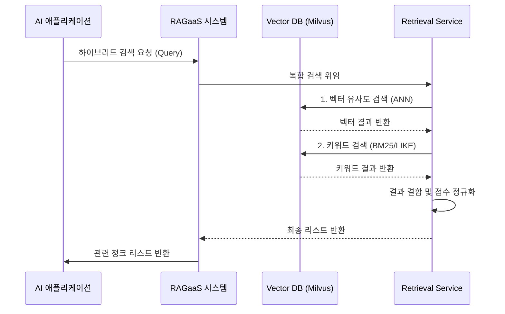

# UC-201-하이브리드 검색 실행

## 개요

### Use Case ID
UC-201

### 제목
하이브리드 검색 실행

### 설명
AI 애플리케이션이나 사용자가 질문(Query)을 던졌을 때, 벡터 유사도 검색(ANN)과 키워드 검색(BM25/Like)을 결합하여 최적의 관련 정보 조각을 검색한다.

## 액터

### Primary Actor
AI 애플리케이션 (또는 시스템 관리자)
- **역할**: 정보 요청자
- **설명**: 질문에 대한 답변 생성을 위해 관련 컨텍스트를 필요로 하는 주체

### Secondary Actor
Retrieval Service, Vector DB (Milvus)
- **역할**: 검색 결과 제공자
- **설명**: 실제 데이터베이스 접근 및 하이브리드 로직 처리

## 사전조건
- 지식 베이스가 구성되어 있고, 문가 성공적으로 인덱싱되어 있어야 한다.

## 사후조건
- 질문과 관련성이 높은 텍스트 청크들이 가공된 점수(Score)와 함께 정렬되어 반환된다.

## 주요 시나리오

1. Primary Actor가 시스템에게 검색 쿼리와 검색 옵션(지식 베이스 ID, Top-K 등)을 전달한다.
2. 시스템은 쿼리 문자열을 Embedding Service에게 전달하여 벡터로 변환한다.
3. 시스템은 벡터 데이터베이스(Milvus)에 대해 ANN 유사도 검색을 수행한다.
4. 시스템은 동일한 데이터베이스(Milvus 또는 SQLite)에 대해 키워드 기반 검색을 수행한다.
5. 시스템은 두 검색 결과를 결합(Reciprocal Rank Fusion 등)하고 중복을 제거한다.
6. 시스템은 결합된 결과에 대해 통합 점수(Normalized Score)를 계산한다.
7. 시스템은 시스템 관리자에게 최상위 검색 결과 리스트를 반환한다.

### 시나리오 다이어그램

## 대안 시나리오

### 1a. 특정 전략 선택
사용자가 하이브리드가 아닌 벡터 전용 또는 키워드 전용 전략을 선택한 경우

1a.1. 시스템은 선택된 단일 검색 프로세스만 수행하고 결과를 반환한다.

## 예외 시나리오

### E1. 관련 정보 없음
검색 결과가 Score Threshold 미만이거나 검색 결과가 0건인 경우

E1.1. 시스템은 '관련된 정보가 발견되지 않았습니다'라는 빈 결과를 반환한다.

## 관련 Use Case
- UC-203: 검색 파이프라인 실험 (실험된 설정이 반영된 실서비스 검색)
