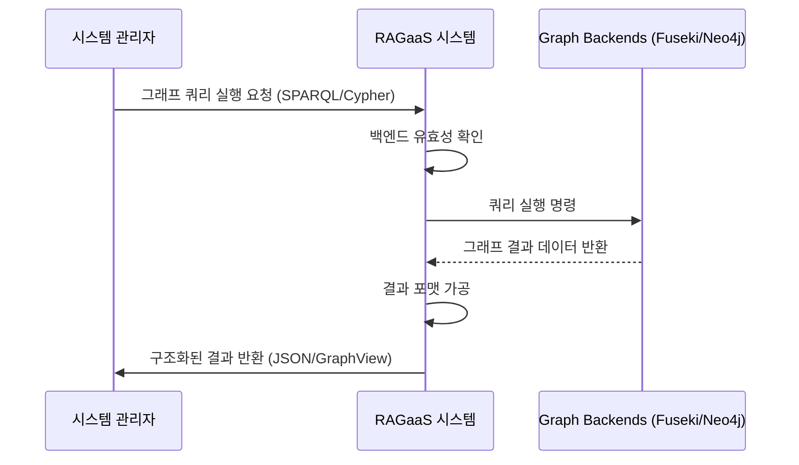

# UC-202-그래프 기반 검색 실행

## 개요

### Use Case ID
UC-202

### 제목
그래프 기반 검색 실행

### 설명
지식 그래프 데이터(Entities, Relations)를 대상으로 SPARQL(Fuseki) 또는 Cypher(Neo4j)를 사용하여 구조화된 질의를 수행하고, 단순 텍스트 매칭으로 찾기 힘든 정보 간의 관계를 검색한다.

## 액터

### Primary Actor
시스템 관리자 (또는 AI 애플리케이션)
- **역할**: 구조적 정보 탐색자
- **설명**: 엔티티 간의 경로 탐색이나 복잡한 온톨로지 기반 쿼리가 필요한 주체

### Secondary Actor
Graph DB (Fuseki / Neo4j)
- **역할**: 구조적 데이터 저장소
- **설명**: 그래프 쿼리를 실행하고 결과를 반환함

## 사전조건
- 지식 추출(UC-102)을 통해 지식 트리플 데이터가 그래프 DB에 적재되어 있어야 한다.

## 사후조건
- 쿼리 조건에 맞는 엔티티, 속성, 또는 관계 리스트가 반환된다.

## 주요 시나리오

1. Primary Actor가 시스템에게 그래프 쿼리(SPARQL/Cypher)를 입력하고 실행을 요청한다.
2. 시스템은 선택된 그래프 백엔드(Fuseki 또는 Neo4j)의 활성 상태를 확인한다.
3. 시스템은 쿼리를 해당 백엔드 엔진에 전달한다.
4. 시스템은 그래프 데이터베이스로부터 결과를 수집한다.
5. 시스템은 검색 결과를 구조화된 데이터(JSON, Table 등)로 가공한다.
6. 시스템은 Primary Actor에게 최종 결과를 반환한다.

### 시나리오 다이어그램

## 예외 시나리오

### E1. 쿼리 문법 오류
입력된 SPARQL 또는 Cypher 구문이 백엔드 엔진의 문법에 맞지 않는 경우

E1.1. 시스템은 데이터베이스 엔진으로부터 받은 구문 오류 메시지를 상세히 표시한다.
E1.2. 시스템 관리자에게 쿼리 수정을 안내한다.

## 관련 Use Case
- UC-104: 온톨로지 프로모션 (추론 기반 검색을 위한 기반 구성)
- UC-203: 검색 파이프라인 실험 (실험 환경에서 그래프 검색을 조합함)
