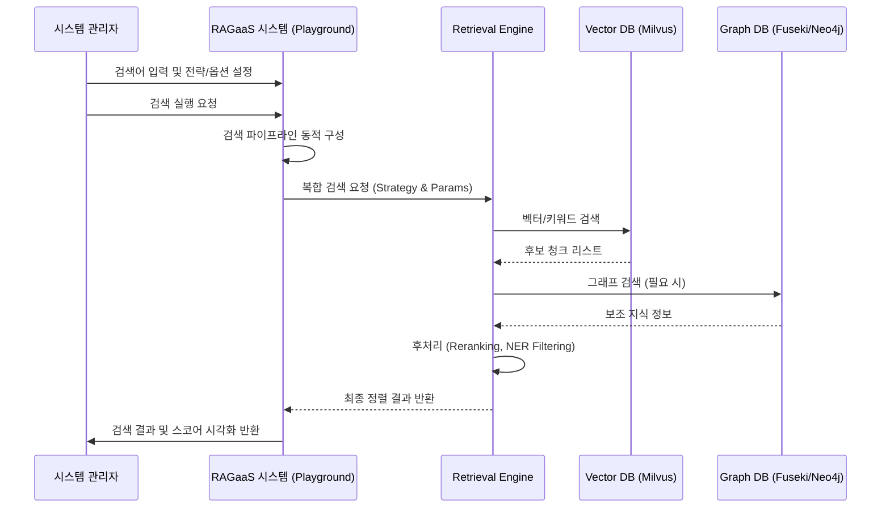

# UC-203-검색 파이프라인 실험

## 개요

### Use Case ID
UC-203

### 제목
검색 파이프라인 실험 (Playground)

### 설명
시스템 관리자가 지식 베이스의 검색 품질을 최적화하기 위해 다양한 검색 전략(벡터, 그래프, 하이브리드)과 후처리 필터(리랭커, NER) 파라미터를 실시간으로 조합하고 그 결과를 검증한다.

## 액터

### Primary Actor
시스템 관리자
- **역할**: 검색 품질 최적화 담당자
- **설명**: 최적의 검색 파이프라인 구성을 위해 다양한 실험을 수행함

### Secondary Actor
Retrieval Engine, AI Application (Client)
- **역할**: 검색 서비스 제공자
- **설명**: 관리자의 실험 설정에 따라 실제 검색 연산을 수행함

## 사전조건
- 최소 하나 이상의 지식 베이스가 생성되어 있고, 인덱싱된 문서가 존재해야 한다.
- 플레이그라운드 UI에 접속해 있어야 한다.

## 사후조건
- 실험한 검색 파이프라인의 결과(청크, 점수, 메타데이터)가 관리자에게 표시된다.
- 최적의 설정값을 확인하여 시스템 기본값으로 반영할 수 있는 정보를 얻는다.

## 주요 시나리오

1. 시스템 관리자가 플레이그라운드에서 검색 쿼리를 입력한다.
2. 시스템 관리자가 검색 전략(ANN, Keyword, Hybrid, GraphSearch 등)을 선택한다.
3. 시스템 관리자가 검색 옵션(Top-K, Threshold, 리랭커 사용 여부, NER 필터 강도 등)을 설정한다.
4. 시스템 관리자가 시스템에게 검색 실행을 요청한다.
5. 시스템은 설정된 전략과 옵션에 따라 검색 파이프라인을 동적으로 구성한다.
6. 시스템은 Retrieval Engine을 호출하여 결과를 수집하고 후처리를 적용한다.
7. 시스템은 시스템 관리자에게 최종 검색 결과와 각 단계별 처리 점수(Score Breakdowns)를 반환한다.
8. 시스템 관리자는 결과를 확인하고 파라미터를 재조정하여 반복 실험한다.

### 시나리오 다이어그램

## 대안 시나리오

### 5a. 그래프 전용 검색 선택
벡터 검색 없이 그래프 쿼리(Cypher/SPARQL)만으로 구조적 검색을 수행하는 경우

5a.1. 시스템은 그래프 데이터베이스 백엔드(Fuseki 또는 Neo4j)를 직접 조회한다.
5a.2. 시스템은 추출된 그래프 노드 및 관계 정보를 반환한다.

## 예외 시나리오

### E1. 리소스 한계/타임아웃
너무 광범위한 하이브리드 검색 요청이나 복잡한 그래프 연산으로 인해 응답이 지연되는 경우

E1.1. 시스템은 검색 연산을 중단하고 타임아웃 오류 메시지를 표시한다.
E1.2. 시스템 관리자에게 검색 범위를 좁히거나 파라미터를 완화하도록 안내한다.

## 관련 Use Case
- UC-201: 하이브리드 검색 실행 (실제 서비스 애플리케이션용)
- UC-102: 지식 추출 및 인덱싱 (기초 데이터 제공)

## 비고
- 플레이그라운드에서의 실험 결과는 로그로 저장되어 나중에 아키텍처 결정(ADR)의 근거로 활용될 수 있음.
