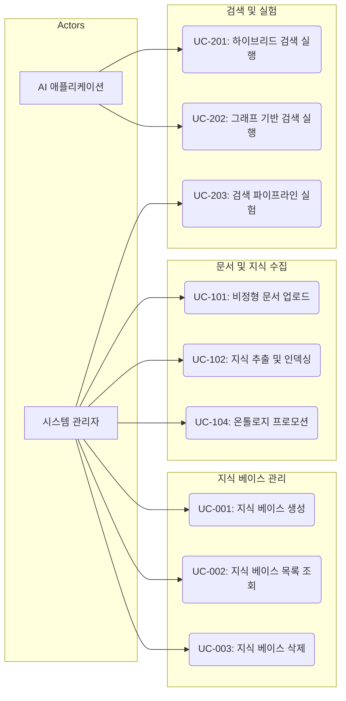

# Use Case 목록

## Use Case Diagram

## 1. 지식 베이스 관리 (Knowledge Base Management)
- **UC-001: 지식 베이스 생성**
  - 시스템 관리자가 새로운 지식의 저장소인 지식 베이스를 생성한다.
- **UC-002: 지식 베이스 목록 조회**
  - 시스템 관리자가 생성된 지식 베이스의 목록과 메타데이터(문서 수, 크기 등)를 확인한다.
- **UC-003: 지식 베이스 삭제**
  - 시스템 관리자가 특정 지식 베이스와 그에 속한 모든 데이터(벡터, 그래프, 문서)를 삭제한다.

## 2. 문서 및 지식 수집 (Document & Knowledge Ingestion)
- **UC-101: 비정형 문서 업로드**
  - 시스템 관리자가 PDF, TXT, Markdown 파일을 업로드한다.
- **UC-102: 지식 추출 및 인덱싱**
  - 시스템이 업로드된 문서에서 텍스트 청크를 추출하고 벡터(Milvus) 및 트리플(Fuseki/Neo4j) 형태로 저장한다.
- **UC-103: 문서 처리 상태 모니터링**
  - 시스템 관리자가 업로드된 문서의 처리 프로세스(Pending, Processing, Completed, Error)를 확인한다.
- **UC-104: 온톨로지 프로모션 (Ontology Promotion)**
  - 시스템 관리자가 추출된 지식 그래프 데이터로부터 온톨로지 스키마를 생성 또는 업데이트한다.

## 3. 검색 및 실험 (Retrieval & Playground)
- **UC-201: 하이브리드 검색 실행**
  - AI 애플리케이션 또는 시스템 관리자가 벡터(ANN)와 키워드(BM25)가 결합된 검색을 수행한다.
- **UC-202: 그래프 기반 검색(Cypher/SPARQL) 실행**
  - 시스템 관리자가 지식 그래프를 대상으로 구조화된 쿼리를 실행하여 관련 정보를 추출한다.
- **UC-203: 검색 파이프라인 실험 (Playground)**
  - 시스템 관리자가 플레이그라운드에서 검색 전략, 리랭커 사용 여부, NER 필터 파라미터를 조정하며 검색 성능을 테스트한다.
